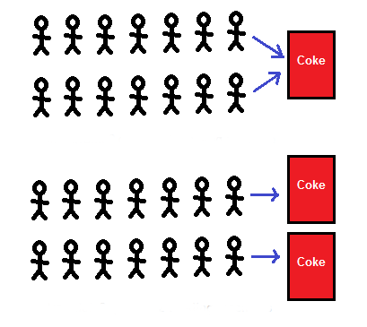

### Wprowadzenie do Javy


---

Pierwsza wersja języka ukazała się w **1996** roku w wersji **1.0**.

Ostatnią stabiliną wersją jest **Java 13** wydana **17 września 2019 roku**.

Wersja **LTS** (*ang. long-time support*) o numerze **11** została wydana **25 września 2018**. 

---

### Zmienne i typy
Zmienne są konstrukcją pozwalającą odwołać się do miejsca w pamięci przechowującego jakąś wartość.

---

Każda zmienna posiada **typ**, **nazwę** oraz **wartość**.

Stworzenie zmiennej, to tak zwana **deklaracja zmiennej**, przyjmująca postać: **typ nazwa**. 

```java
int size; ||1||
long length;
double radius; 
boolean turnedOn; ||2||
char a; ||3||
```

||1|| Zmienne typu **int**, **long**, **double** mogą przechowywać wartości liczbowe. =>
||2|| Zmienna typu **boolean** może przechowywać wartość logiczną. =>
||3|| Typ **char** pozwala przechowywać pojedyńczy znak.

---

###### Typy podstawowe

* **int** - czterobajtowa liczba całkowita w zakresie od **-2147483648** do **2147483647**.
* **long** - ośmiobajtowa liczba całkowita w zakresie od **-9223372036854775808** do **9223372036854775807**.
* **short** - dwubajtowa liczba.
* **byte** - jednobajtowa liczba.
* **double** - liczba zmiennoprzecinkowa podwójnej precyzji.
* **float** - liczba zmiennoprzecinkowa pojedynczej precyzji.
* **char** - pojedynczy znak.
* **boolean** - typ logiczny, możliwe wartości to **true** lub **false**.

---

Umieszczanie wartości w zmiennej to tak zwane **przypisanie** wartości. Możemy przypisać tylko wartość typu odpowiadającego typowi zmiennej.

```java
int size;
boolean isTall;
size = 10; ||1||
__isTall = 100__; ||2|| #!# incompatible types #!#
```
||1|| Możemy przypisać wartość **10** do zmiennej **size**. =>
||2|| **Nie** możemy przypisać wartość **100** do zmiennej **name**, ponieważ typ tej zmiennej jest logiczny.

Możemy również przypisać zmiennej wartość od razu podczas jej tworzenia. Jest to tak zwana **inicjalizacja** zmiennej.

```java
int age = 18;
char c = 'c';
boolean wasInitialized = true;
```

---

Do zmiennej możemy wielokrotnie przypisywać nową wartość. Możemy również użyć zmiennej do przypisania wartości do nowej zmiennej:

```java
int age = 18;
age = 21;

int ageLimit = age; #! 21 !#

age = 32;

```
Próba zadeklarowania zmiennej o tej samej nazwie zakończy się błędem:

```java
int distance = 0;
__int distance = 100__; #!# Variable 'distance' is already defined in scope. #!#
```

W przypadku interaktywnej sesji w **jshell** możemy ponownie zadeklarować zmienną i zastąpi ona wtedy już isniejącą.

---

###### Operacje arytmetyczne

Operatory arytmentyczne pozwalają nam na wykonywanie operacji na zmiennych przechowujących typy liczbowe:

* **+** - dodawanie.
* **-** - dodawanie.
* **\*** - mnożenie.
* **/** - dzielenie.
* **%** - reszta z dzielenia (inna nazwa to operacja *modulo*).
* **++** zwiększenie wartości o **1** (jest to tak zwana *inkrementacja*).
* **--** zmniejszenie wartości o **1** (tak zwana *dekrementacja*)

---

Operacje arytmentyczne możemy wykonywać na argumentach, które zostały podane w bezpośredni sposób (są to tak zwane&nbsp;**literały**) albo pośrednio używając zmiennych.
Argumenty operatora to, tak zwane **operandy**.
Wyniki następujących po sobie operacji możemy przypisać do kolejnych zmiennych:

```java
int a = 1 + 2; #!3!# ||1||
int b = 100 + a; #!103!#
int b = b + 10; #!113!# ||2||
int d = a * 500; #!1500!#
int div = 100 / 3 #!33!# ||3||

double radius = 500;
double circleArea = 3.14 * radius * radius; #!785000.0!#
double circleCircuit = 2 * 3.14 * radius; #!3140.0!# ||4||

double l = 2.5;
__int squareArea = l * l__; ||5|| #!# incompatible types #!#

double v = 1.0;
double calc = (0.5 + v) * 100 + 100 * v; #!250.0!# ||6||
```
||1|| Dodajemy dwa literały liczb całkowitych o wartościach **1** i **2** oraz przypisujemy wynik do zmiennej. =>
||2|| W tym samym wyrażeniu możemy wykorzystać zmienną do obliczeń, a następnie przypisać do niej wynik. =>
||3|| Dzielenie liczb całkowitych powoduje, że z wyniku zostanie usunięta część ułamkowa. =>
||4|| Do obliczeń wykorzystujących liczby zmiennoprzecinkowe, możemy również użyć liczb całkowitych. Wynikiem będzie liczba zmiennoprzecinkową. =>
||5|| Jeżeli spróbujemy przypisać liczbę zmiennoprzecinkową do zmiennej typu całkowitego otrzymamy błąd kompilacji. =>
||6|| W złożonych wyrażania operacje wykonywane są od lewej do prawej, ale obowiązuje również kolejność operatorów podobna jak w matematyce (mnożenie i dzielenie przed dodawanie i odejmowaniem).
Kolejność opracji możemy modyfikować nawiasami.
---

Operacja modyfikacji wartości i przypisania jej z powrotem do tej samej wartości jest na tyle częsta, że istnieje specjalna notacją pozwalająca skrócić jej zapis.
Jest to tak zwana modyfikacja wartości zmiennej "*miejscu*". 

```java
int a = 100;
a += 100 #! 200 !#
a /= 100 #! 2 !#
a *= 3 #! 6 !#
```

Powyższy zapis jest równoznaczny z:

```java
int a = 100;
a = a + 100; 
a = a / 2;
a = a * 3;
```

Operacjami modyfikującymi wartość zmiennej w "*miejscu*" jest również inkrementacja oraz dekrementacja.
W przypadku gdy napiszemy operator przed nazwą zmiennej to wykonujemy **preinkrementację/predekrementcję**, a gdy napiszemy po nazwie zmiennej to wtedy jest to **postinkrementacja/postdekrementacja**.
```java
int initial = 100;
int h1 = initial++; #! 100 !#
int h2 = ++initial; #! 102 !#

int l1 = --initial; #! 101 !#
int l2 = initial--; #! 101 !#

int copy = initial; #! 100 !#

int result = (copy++) + (++initial) - (initial--); #! 100 + 101 - 101 = 100 !#

```

---

Kiedy tworzymy literał liczby, to domyślnymi wartościami dla liczby całkowitej to **int**, a dla liczby zmiennoprzecinkowej **double**:
```java
1 #!int!#
1.0 #!double!#
```

Aby stworzyć liczby inny typów musimy skorzystać z odpowiednich suffixów:
```java
1L #!long!#
1.0f #!float!#
```
Dla typów **short** oraz **byte** nie istnieją specjalne suffixy.

Jeżeli spróbujemy przypisać wartość do zmiennej o szerszym typie (na przykład **int** do **long** albo **float** do **double**), to zostanie ona niejawnie rozszerzona:

```java
long a = 100;
double b = 1.0f;
```

Gdy będziemy próbowali przypisać szerszy typ do zmiennej o zawężonym typie, zostanie zgłoszony bład kompilacji:

```java
__int a = 1000L;__ #!# incompatible types #!#
```

---
Aby zmienić typ zmiennej należy przeprowadzić operację rzutowania (*ang. casting*):

```java
long b = 100L
int a = (int) b; ||1||

long c = 1111111111111L;
int d = (int) c; #!-1285418553!# ||2||

boolean e = true;
__int f = (int) e;__ ||3||  #!# incompatible types #!#
```
||1|| Rzutowanie przeprowadzamy poprzez napisanie nazwy typu w nawiasach. =>
||2|| Operacja rzutowania wiąże się z ryzykiem tego, że poprawna wartość z szerszego typu nie będzie prawidłową wartością węższego.
W przypadku liczb całkowitych może nastąpić tak zwane **przepełnienie** (*ang. integer overflow*), co może skutkować nieprzewidywalnymi wartościami. =>
||3|| Próba wykonania rzutowania na niekompatybilnych typach spowoduje błąd kompilacji. =>

---

##### Biblioteka matematyczna

Biblioteka standardowa języka Java posiada wbudowaną bibliotekę funkcji matematycznych.
 
Składnia wywołania funkcji to **nazwa_obiektu.nazwa_funkcji(parametr1, parametr2, ...)***.

W przypadku biblioteki możemy korzystać z następujących metod: 

* **Math.sqrt** - ta funkcja wyznacza pierwiastek kwadatowy z podanej liczby zmiennoprzecinkowej.
* **Math.pow** - oblicza pierwszy parametr podniesiony do potęgi liczby podanej jako drugi parametr.
* **Math.abs** - wyznacza moduł (wartość bezwzględną) z podanej liczby.
* **Math.sin**, **Math.cos** i **Math.tan** obliczają sinus, cosinus oraz tangens z podanej liczby.
* **Math.floor** - zwraca liczbę zmiennoprzecinkową zaaokrąglona w dół do całości.
* **Math.ceil** - zwraca liczbę zmiennoprzecinkową zaaokrąglona w górę do całości.
* **Math.round** - zwraca liczbę zmiennoprzecinkową zaaokrąglona do najbliższej całości.  

```java
double p = Math.pow(2.0, 2.0); #! 4.0 !#
double s = Math.sqrt(16.0); #! 4.0 !#
int a = Math.abs(-100); #! 100 !#
int b = Math.abs(100); #! 100 !#
double f = Math.floor(3.6); #! 3.0 !#
double c = Math.ceil(3.6); #! 4.0 !#
long r = Math.round(3.6); #! 4 !#
```

---

##### Typ logiczny

Typ logiczny (*ang. boolean*) może przyjmować tylko dwie wartości **true** lub **false**. Aby budować bardziej skomplikowane operacje logiczne możemy używać następujących operatorów:

* **!** - operator oznaczający negację, zamieniający wyrażenie logiczne na przeciwne: **true** na **false** oraz odwrotnie.
* **&&** - operator **oraz** (*ang. and*) zwracający **true** tylko jeżeli obydwa operandy również mają wartość **true**.
* **||** - operator **lub** (*ang. or*) zwracający **true** jeżeli chociaż jeden z operandów ma wartość **true**.

```java
boolean t1 = true;
boolean t2 = true;
boolean f = false;

boolean r1 = !t1; #! false !# 
boolean r2 = t1 && t2; #! true !#
boolean r3 = t1 && f; #! false !#
boolean r4 = t1 || f; #! true !#
boolean r4 = !(t1 && f) && t2 || f; #! true !#
```

---

###### Operatory porównywania

Wartości liczbowe możemy porównywać za pomocą operatorów porównywania:

* **<** - operator sprawdzający czy lewy operand jest mniejszy od prawego.
* **<=** - operator sprawdzający czy lewy operand jest mniejszy od prawego lub równy mu.
* **==** - operator równości sprawdzający czy lewy operand jest równy prawemu.
* **>** - operator sprawdzający czy lewy operand jest większy od prawemego.
* **>=** - operator sprawdzający czy lewy operand jest większy od prawemego lub równy mu.

Wszystkie operatory porównania zwracają typ logiczny: **true** jeżeli porównanie jest prawdziwe, **false** w przeciwnym wypadku.

```java
int a = 10;
int b = 20;
int c = 15;

boolean isLess1 = c < 20; #! true !#
boolean isLess2 = c + a < b; #! false !# 
boolean isLessOrEqual = a + a <= b; #! true !#
boolean isEqual = a + b == c * 2; #! true !#
boolean isGreater = b > c + a; #! false !#

```
---

###### Łańcuchy znaków

Tekst reprezentowany jest przez tak zwane łańcuchy znaków (*ang. string*). Aby stworzyć łańcuch znaków należy umieścić tekst w cudzysłowiu. 
Następnie możemy przypisać go do zmiennej typu **String**:

```java
String text = "Hello world";
```


Łańcuchy możemy łączyć za pomocą operatora plus **+**:

```java
String firstName = "Roman";

String fullName1 = "Ryszard" + " " + "Wójcik"; #! "Ryszard Wójcik" !#
String fullName2 = firstName + " Nowak"; #! "Roman Nowak" !#
```

Do łańcuchów znaków możemy również dołączać zmienne innych typów niż **String**. W takim przypadku zostaną niejawnie skonwertowane na **String**:

```java
int age = 100;
double weigth = 99.4;

String s = "Tadeusz ma " + age + " lat oraz waży " + weigth + " kilogramy.";
#! "Tadeusz ma 100 lat oraz waży 99.4 kilogramy." !#
```

@! Aby sprawdzić, czy dwa łańcuchy znaków są takie same należy użyć funkcji **equals** zamiast operatora **==**. !@

```java
"test".equals("test");
```

---

###### Znaki specjalne

Podczas tworzenia łańcuchów tekstu możemy użyć również specjalnych znaków, tak zwanych znaków ucieczki (*ang.&nbsp;escape&nbsp;characters*):

* Znak **\n** (*newline*) oznacza znak końca linii. Wszystkie znaki następującej po nim zostaną wydrukowane w następnej linii.
* Znak **\t** (*tabulation*) oznacza tabulację.
* Znak **\b** (*backspace*) oznacza usunięcie ostatniego znaku.
* Znak **\"** Pozwala na dodanie cudzysłowia w łańcuchu znaków.
* Znak **\\** Pozwala na dodanie znaku *backslash*.

---

##### Drukowanie tekstu na konsoli

Do wydruku na standardowym strumieniu wyjścia konsoli możemy użyć metod:

* **System.out.print** drukujące łańcuch znaków bez znaku końca linii.
* **System.out.println** drukujące łańcuch znaków razem ze znakiem końca linii.

Możemy również użyć analogicznych metod drukujących na strumień błedów:

* **System.err.print**
* **System.err.println**

```java
System.out.println("Hello world!");
System.err.println("Oh noo!")
```

---

###### Struktura aplikacji

Aby stworzyć prostą aplikację, musimy stworzyć plik posiadający określoną strukturę.

```java
package io.app; ||1||

class EntryPoint { ||2||
    
    public static void main(String[] args) { ||3||
        String greeting = "Hello" + ", " + "world";
        System.out.println(greeting  + "!"); ||4||
    }

}
```
||1|| Deklaracja pakietu do którego należy dana klasa. =>
||2|| Nazwa klasy poprzedzona słowem kluczowym **class**. Zwykle jest ona identyczna z nazwą pliku. Nazwa klasy może być dowolnym łańcuchem znaków nie rozpoczynającym się cyfrą. => 
||3|| Metoda **main** określa punkt wejścia do aplikacji. Ta metoda zawsze musi mieć sygnaturę **public static void main(String[])**.
||4|| Instrukcje, które zostaną wykonane po uruchomieniu aplikacji.

---

##### Komentarze

Komentarze pozwalają na dodawanie w kodzie źródłowym dopisków, które są ignorowane przez kompilator.

Język **Java** obsługuje komentarze jednolinijkowe poprzez użycie znaków **//**:

```java
int idx = 6; //ten tekst zostanie zignorowany
//ten tekst również
```

Możemy dodawać również wielonilinkowe komentarze używać znaków **/\*** na początku komentarza oraz **\*/** na końcu:

```java
String value; /* początek komentarza
w dalszym ciągu komentarz
koniec komentarza */

```

---

###### Pakiety

Pakiety pomagają grupować pliki klas. Struktura pakietów zwykle odpowiada hierarchii plików w projekcie:

>* pl
   * app
     * scanner
       * utils
         * PathParser.java ||1||
         * AnotherFile.java
       * model
         * ModelResolver.java

```java
package pl.app.scanner.utils; ||1||

public class PathParser { ||2||
    
    public static void main(String[] args) {
        System.out.println("Hello world!");
    }
     
}
```

||1|| Deklaracja pakietu musi znajdować się na pierwszym miejscu w pliku. Podajemy ją po słowie kluczowym **package**, dzieląc kolejne części kropką.
Nazwa pakietu odpowiada położeniu pliku klasy w hierarchii folderów. Według konwencji nazwy pakietów zaczynamy odwracając nazwę domeny. =>

||2|| Nazwa klasy w większości wypadków odpowiada nazwie pliku. Rozszerzeniem pliku z kodem źródłowym jest zwykle **java**.

---

##### Importowanie plików 

Aby zaimportować plik z innych pakietów należy użyć słowa kluczowego **import**. Wszystkie klasy znajdujące się w pakiecie **java.lang** są domyślnie zaimportowane.

```java
package com.github.scanner.utils; ||1||

import com.github.scanner.model.ModelResolver; ||2||
import java.util.Locale; ||3||
import java.util.Scanner;
import java.io.*; ||4||

```

||1|| Deklaracje importów znajdują się na początku pliku zaraz po deklaracji pakietu. =>
||2|| Aby zaimportowąć klasę należy podać pełną nazwę pakietu. =>
||3|| Jeden plik może mieć wiele deklaracji importów. =>
||4|| Aby zaimportować wszystkie pliki z pakietu należy użyć znaku gwiazdki: **\***. =>

---

###### Wczytywanie danych z wejścia

Aby wczytać dane ze standardowego strumienia wejścia najłatwiej jest się posłużyć klasą **Scanner**:

```java
import java.util.Scanner;

Scanner scanner = new Scanner(System.in); ||1||
String myString = scanner.next(); ||2||
int myInt = scanner.nextInt();
boolean myBool = scanner.nextBoolean();
scanner.close(); ||3||
```

||1|| **Scanner** tworzymy przekazując do niego obiekt reprezentujący strumień błędów. =>
||2|| Używając skanera możemy wczytywać wygodnie wartości od razu o odpowiednim typie. W przypadku gdy użytkownik poda
dane, które nie będę mogły być zamienione na żądany typ, to zostanie złoszony błąd **java.util.InputMismatchException**.
Przykładowo może to się zdażyć, gdy będziemy chcieli wczytać liczbę używająć metody **nextInt**, a użytkownik wpisze łańcuch **"razdwa"**. =>
||3|| Jeżeli nie chcemy korzystać już ze skanera, ale ciągle chcemy kontynuować działanie aplikacji, powiniśmy zwolnić zasoby zaalokowane przez skaner wywołująć metodę **close**.

---

###### Atrybut final

Zmienne oznaczone atrybute **final** muszą zostać zainicjalizowane od razu po zadeklarowaniu, a później nie może zostać przypisana do nich
inna wartość.

```java
final String name = "Andrzej";
__name = "Tomasz";__ #!# Cannot assign a value to final variable 'name'. #!#
```


---

### Instrukcje sterujące
Instrukcje sterujące pozwalają na warunkowe wykonywanie instrukcji.

---

###### Instrukcja if

Instrukcja **if** pozwala na warunkowe wykonanie operacji, tylko jeżeli jakieś wyrażenie logiczne zwraca **true**.

!_#
@@@if@@@ (**[wyrażenie logiczne]**) {
  **[instrukcje]**
}
#_!

```java
int a = 100;

if (a > 10) {
    System.out.println("a jest większe od 10.");
}
if (a > 50) {
    System.out.println("a jest większe od 50.");
}
if (a > 100) {
    System.out.println("a jest większe od 100.")
}
```

---

Używając słowa kluczowego **else** możemy również sprecyzować operację, które miałyby się wykonać jeżeli wyrażenie logiczne w instrukcji **if** nie zostanie spełnione:

!_#
@@@if@@@ (**[wyrażenie logiczne]**) {
  **[instrukcje]**
} @@@else@@@ {
  **[instrukcje]**
}
#_!

```java
boolean fileExists = false;

if (fileExists) {
    System.out.println("Plik istnieje!");
} else {
    System.out.println("Plik nie istnieje!");
}
```

---
W przypadku gdy chcemy zbudować bardziej rozbudowane wyrażenia warunkowe, możemy umieścić kolejne wywołania instrukcji **if-else** po sobie:
!_#
@@@if@@@ (**[wyrażenie logiczne]**) {
  **[instrukcje]**
} @@@else if@@@ (**[wyrażenie logiczne]**) {
  **[instrukcje]**
} @@@else if@@@ (**[wyrażenie logiczne]**) {
  **[instrukcje]**
} @@@else@@@ {
  **[instrukcje]**
}
#_!

```java
int age = 25;
int insurance;

if (age < 18) {
   insurance = 100;
} else if(age < 25) {
   insurance = 125; 
} else if(age < 45) {
   insurance = 150;
} else {
   insurance = 120;
}
```
---

###### Instrukcja switch-case

Innym rodzajem instrukcji warunkowej jest **switch-case**:

!_#
@@@switch@@@ (**[zmienna]**) {
  @@@case@@@ **[wartość]**:
    **[instrukcje]**
    @@@break;@@@
  @@@case@@@ **[wartość]**:
    **[instrukcje]**
    @@@break;@@@
  @@@default@@@:
    **[instrukcje]**
}
#_!

```java
String carBrand = "Opel";
switch(carBrand) {
    case "Skoda":
       System.out.println("Samochód marki Skoda.");
       break;
    case "Opel":
       System.out.println("Samochód marki Opel.");
       break;
    default:
       System.out.println("Nieznana marka.");
}
```

W wyrażeniu switch możemy użyć zmiennych typu **byte**, **short**, **char**, **int** oraz **String**. Możemy także używać go razem z typami wyliczeniowymi.

---

@! Instrukcję **break** należy umieścić po wszystkich instrukcjach jakie chcemy wykonać dla danego rozgałęzienia **switch-case**. Jeżeli nie umieścimy instrukcji **break**, to zostaną wywołane również kolejne instrukcje z innych gałęzi aż do napotkania następnej instrukcji **break**. !@

Nie umieszczając instrukcji **break** na końcu instrukcji możemy stworzyć wyrażenie **switch-case**, które wywoła się dla paru różnych wartości:

```java
int code = 5;

switch(code) {
    case 1:
    case 3:
    case 7:
         System.out.println("Wybrałeś 1, 3 lub 7.");
         break;
    case 2:
    case 9:
         System.out.println("Wybrałeś 2 lub 9.");
         break;
    default:
         System.out.println("Wybrałeś 4, 5, 6 albo 8.")
}
```

---

###### Operator trójargumentowy

**Operator trójargumentowy** (*ang. ternary operator*) pozwala na warunkowe przypisanej jednej z dwóch wartości w zależności od wyniku wyrażenia logicznego.

!_#
[wyrażenie logiczne] @@@?@@@ [wartość w przypadku true] @@@:@@@ [wartość w przypadku false];
#_!

```java
String isMajor = age >= 18 ? "yes" : "no";
```

To wyrażenie jest równoznaczne z zapisem:

```java
String isMajor;
if (age >= 18) {
    isMajor = "yes";
} else {
    isMajor = "no";
}
```

---

###### Pętla while

Pętla (*ang. loop*) **while** pozwala na wielokrotne wykonanie szeregu instrukcji, tak długo aż warunek logiczny pozostanie prawdziwy: 

!_#
@@@while@@@ (**[wyrażenie logiczne]**) {
  **[instrukcje]**
}
#_!

Na przykład:

```java
String line = "*";

while(line.length() < 10) { ||1||
    System.out.println(line);
    line += "*"; ||2||
}
```
||1|| Funkcja **length** pozwala nam pobrać długość łańcucha znaków. =>
||2||  Modyfikujemy zmienną **line** "*w miejscu*" dodająć dodatkowy znak **\*** na końcu łańcucha. 

---

Jeżeli jako warunek podamy w pętli wyrażenie, które zawsze pozostaje prawdziwe, to ta pętla nigdy się nie zakończy.
Jest to tak zwana nieskończona pętla (*ang. infinite loop*).
```java
int i = 0;

while (i < 10) { ||1||
    System.out.println(i);
    i--; ||1||
}
```

||1|| To wyrażenie nigdy nie zostanie spełnione ponieważ, zamiast inkrementować zmienną **i** dekrementujemy ją.

---

###### break i continue

Pętlę możemy również opuścić używając słowa kluczowego **break**:

```java
int j = 0;

while (true) {
    j += 5;
    if (j % 33 == 0) {
        System.out.println("Liczba " + j + " jest podzielna przez 33.");
        break;
    }
}
```

Instrukcja **continue** pozwala nam na ominięcie przebiegu pętli i rozpoczęcie następnego:

```java
int k = 0;

while (k < 100) {
    k += 5;
    if(k >= 20 && k <= 50) {
       continue;
    }
    System.out.print(k);
    System.out.print(" ");
}
```
---

###### Pętla do-while

Pętla **do-while** to odmiana instrukcji **while**.

!_#
@@@do@@@ {
  **[instrukcje]**
} @@@while@@@ (**[wyrażenie logiczne]**)
#_!

 Instrukcja umieszczona w bloku po słowie kluczowym **do** wykona się przynajmniej raz, a następnie jeżeli wyrażenie logiczne
po słowie kluczowym **while** będzie prawdziwe, to pętla wykona się ponownie.

```java
int i = 0;

do {
    i += 3;
    System.out.println("Liczba to: " + i + ".");
} while(i > 2);
```
---

###### Pętla for

Pętla **for** pozwala na inicjalizację stanu początkowego oraz uaktualnianie stanu.

!_#
@@@for@@@(**[inicjalizacja stanu]**@@@;@@@ **[warunek]**@@@;@@@ **[zmiany stanu]**) {
  **[instrukcje]**
}
#_!

```java
int sum = 0;

for(int i = 0 ||1||; i <= 100 ||2||; ++i ||3||) {
    sum += i;
}
```

||1|| W bloku inicjalizacji stanu deklarujemy jedną zmienną **i** oraz inicjalizujemy ją wartością 0. =>
||2|| W bloku warunku sprawdzamy, czy zmienna **i** jest mniejsza lub równa **100**. =>
||3|| W bloku zmiany stanu, który będzie wykonywał się **po każdej** iteracji pętli zwiększamy wartość zmiennej **i** o **1**.

Zmienna używana do sterowania iteracjami pętli jest nazywana często **licznikiem pętli**.

Wszystkie bloki pętli **for** są opcjonalne. Ominięcie bloku warunku jest traktowane jak podanie warunku, który jest zawsze prawdziwy.

---

###### Zakresy zmiennych

Jeżeli zadeklarujemy zmienną w środku bloku, na przykład wewnątrz ciała instrukcji **if** lub wewnątrz ciała pętli, to poza tym blokiem zmienna będzie niedostępna:

```java
int a = 100;

if(a % 2 == 0) {
    String result = "liczba parzysta";
} else {
    String result = "liczba nieparzysta";
}

System.out.println(result); #!# cannot find symbol #!#
```

---
### Tablice

---

Tablice (*ang. arrays*) pozwalają na odwoływanie się do grup danych o tym samym typie używając wspólnej referencji (jednej zmiennej o typie tablicowym).
Tablice tworzymy w następujący sposób:

!_#
**[typ]**@@@[]@@@ **[nazwa zmiennej]** = @@@new@@@ **[typ][rozmiar tablicy]**;
#_!

Na przykład:

```java
int[] ints = new int[8];
String[] strings = new String[20];
long[] longs = new long[100];
```

Aby odwołać się do danego elementu tablicy używamy kwadratowych nawiasów z numerem pozycji danego elementu (*ang. index*).

@! Numerowanie kolejnych indeksów elementów tablicy zaczyna się od **0**. !@

```java
int[] ints = new int[10]; ||1||
ints[5] = 7; ||2||
int sum = 4 + ints[5]; #! 11 !# ||3||
```

||1|| Tworzymy tablicę o rozmiarze **10** elementów. =>
||2|| Odwołujemy sie do **szóstego** elementu tablicy o indeksie **5** przypisując mu wartość **7**. =>
||3|| Ponownie odwołujemy się do **szóstego** elementu tablicy o indeksie **5** pobierając jego wartość oraz sumując z literałem o wartości **4**.

---

Podczas tworzenia tablicy rezerwujemy obszar w pamięci o rozmiarze równym **[rozmiar pojedynczego elementu] x [rozmiar tablicy]**.
 
```java
int[] numbers = new int[6];
numbers[0] = 66;
numbers[1] = 33;
numbers[2] = 44;
numbers[3] = 55;
numbers[4] = 99;
numbers[5] = 77; ||1||
```


Alternatywnie jeżeli znamy wartości wszystkich elentów tablicy podczas tworzenia, możemy użyć notacji: 

```java
new int[] {66, 33, 44, 55, 99, 77} ||2||
```

Możemy zyć też skróconej wersji skróconej wersji

```java
int[] numbers =  {66, 33, 44, 55, 99, 77}; ||3||
```

||1|| Maksymalny indeks elemntu tablicy zawsze będzie równy **jej rozmiarowi minus jeden**. =>
||2|| Jeżeli tworzymy tablicę bezpośrednio podając elementy, to nie musimy jawnie podawać jej rozmiaru (zostanie przyjęte założenie, że rozmiar tablicy równa się ilości jej elementów). =>
||3|| Skróconego zapisu możemy użyć tylko, jeżeli przypisujemy tablicę do zmiennej. 

---

Odwołanie się elementu tablicy, poza jej rozmiarem spowoduje błąd:

```java
String[] texts = new String[]{"ala", "ma", "kota"};
text[3]; #!#ArrayIndexOutOfBoundsException: #!#
text[-1];  #!#ArrayIndexOutOfBoundsException: #!#
```
Aby w czytelny sposób wydrukować tablicę na standardowe wyjście należy użyć metody **Arrays.toString**.

```java
import java.util.Arrays;

String[] strings = new String[]{"ala", "ma", "kota"};

System.out.println(Arrays.toString(strings));
```

---

###### Iterowanie po elementach tablicy
Operacją często wykonywaną na tablicach jest iterowanie (pobieranie wartości) po elementach tablicy. Do tego celu możemy użyć pętli:

```java
int[] numbers = {1, 2, 3};

int product = 1;

for(int i = 0; i < numbers.length ||1||; i++) {
    product *= numbers[i];
}

String result = "Wynik mnożenia to " + product + "."; #! "Wynik mnożenia to 6. !#
```

||1|| Używając właściwości **length** możemy pobrać wielkość tablicy.

---

###### Pętla foreach

Iterowanie po elementach tablicy jest na tyle częstą operacją, że istnieje dodatkowy rodzaj pętli, nazywany pętlą **foreach**, który ułatwia tą operację.

!_# 
@@@for@@@ (**[typ][nazwa zmiennej]**@@@:@@@ **[nazwa_tablicy]**) {
    **[instrukcje]**
}

#_!

```java
String[] numbers = new String[]{"raz", "dwa", "trzy"};

for (String number: numbers) {
    System.out.println(number);
}
```
---

###### Zagnieżdzone tablice

Możemy deklarować także **zagnieżdzone** tablice (tablicę, której elementacji są inne tablice). Takie tablice nazywane są też **wielowymiarowymi**.

```java
int[][] matrix = new int[10][10];
matrix[4][5] = 10;
```

Mamy również mozliwość tworzenia zagnieżdzonych tablicc od razu deklarując elementy:

```java
char[][] tictactoe = {
    {'X', 'O', 'O'},
    {'O', 'X', 'O'},
    {' ', 'X', ' '},
};
```

Dozwolone jest takżę tworzenie tablic o więcej niż 2 wymiarach.

```java
String[][][][] deeplyNested = new String[2][2][2][2];
```

---

Wygodnym sposobem na iterowanie po zagnieżdzonych tablicach jest użycie zagnieżdzonych pętli:

```java
char[][] tictactoe = {
    {'X', 'O', 'O'},
    {'O', 'X', 'O'},
    {' ', 'X', ' '},
};

for(int i = 0 ||1||; i < tictactoe.length; ++i) {
   for(int j = 0 ||1|| ; j < tictactoe[i].length ||2||; ++j) { 
       System.out.print(tictactoe[i][j]); ||3||
   }
   System.out.print("\n"); ||3||
}
```

||1|| Zewnętrzna pętla używa zmiennej **i** jako licznika pętli, a wewnętrzna **j**. =>
||2|| W wewnętrznej pętli iterujemy po zagnieżdzonej tablicy, którą wcześniej pobieramy jako element zewnętrznej tablicy. =>
||3|| Przy każdej iteracji wewnętrzej pętli drukujemy element wewnętrzej tablicy, ale znak nowej linii drukujemy tylko zakończeniu iteracji każdej zewnętrznej pętli. 

---

### Funkcje i metody
Funkcje pozwalają na wielokrotne wykorzystywanie fragmentów kodu.

---

Funkcje pozwalają na tworzenie fragmentów kodu, które mogą być wywoływane z określonymi parametrami i mogą zwracać wynik.

```java
class App { ||1||
   static ||2|| int times(int i, int n) { ||3||
      int product = 1;
      for(int j = 0; j < n; j++) {
          product *= i; 
      }
      return product; ||4||
   }

   public static void main(String[] args)
      times(5, 0); #! 1 !# ||5||
      times(5, 1); #! 5 !#
      times(5, 3); #! 125 !#
   }
}
```
||1|| Funkcje zadeklarowane w klasach są nazywane metodami. W języku **Java** każda funkcja musi być zadeklarowana wewnątrz klasy, więc każda funkcja jest metodą. =>
||2|| Aby funkcja mogła być wywoływana bezpośrednio z funkcji **main** musimy dodać atrybut **static**. =>
||3|| Deklarujemy funkcję zwracającą **int** o nazwie **times**, która przyjmuje dwa parametry o nazwach **i** oraz **n**. Nazwa, zwracany typ oraz parametry tworzą tak zwaną **sygnaturę funkcji**. =>
||4|| Wartość może zostać zwrócona z funkcji za pomocą słowa **return**. Funkcja musi zwrócić wartość o typie zgodnym z tym zgłoszonym w sygnaturze. Zwrócenie wartości kończy działanie funkcji. =>
||5|| Po tym jak funkcja zostanie zadeklarowana może być wielokrotnie wywoływana. 

---

Funkcja może zawierać wiele instrukcji **return**. Dotarcie do jakiejkolwiek instrukcji **return** kończy działanie funkcji. 

```java
String getDescription(int age) {
    if(age <= 1) {
       return "niemowlę";
    } else if(age < 10) {
       return "dziecko";
    } else if(age < 18) {
      return "nastolatek";
    } else {
      return "dorosły";
    } 
}
```

---

Funkcje mogą wywoływać także same siebie. Takie wywoływania nazywane są wywoływaniami **rekurencyjnymi**.


```java
int factorial(int n){ 
  if (n == 0) {
    return 1; ||1||
  } else {    
    return (n * factorial(n-1)); ||2||
  }    
}    
```

||1|| W przypadku gdy wartość parametru **n** wynosi **0** zwracamy wartość **1**. =>
||2|| W każdym innym przypadku wywołujemy znowu funkcję z parametrem **n** pomniejszonym o **1** mnożąc wynik razy **n**.

Jeżeli funkcja **rekurencyjna** zostanie napisana w ten spośób, że nigdy nie zakończy działania, to może spowodować błąd przepełnienia stosu (*ang. stackoverflow*). 


---

Jeżeli funkcja nie zwraca żadnych wartości to zamiast typu należy użyć słowa kluczowego **void**. Funkcje nie zwracające żadnych wartości nazywane są **procedurami**.

```java
void printTemperaturesUntilPositive(double[] temperatures) {
    for(double temperature: temperatures) {
       if(temperature <= 0) {
          return; ||1||
       }
       System.out.println("Temperatura wynosi " + temperature +"."); 
    }
}

printTemperature(33.0);
__int value = printTemperature(28.00);__ ||2|| #!#incompatible types#!#
```

||1|| W środku procedury możemy użyć słowa **return** aby zakończyć działanie funkcji. Użycie **return** w procedurach jest opcjonalne. Jeżeli go
nie użyjemy to procedura po dotarciu do końca instrukcji zakończy działanie. =>
||2|| Próba przypisania wywołania funkcji zwracającej **void** do zmiennej zakończy się błędem kompilacji.


---

### Klasy
Klasy pozwalają na zgrupowanie zmiennych opisujących jakiś stan oraz metod modyfikujących ten stan w jedną logiczną całość.  

---


**Klasa** to częściowa lub całkowita definicja (szablon) pozwalająca tworzyć obiekty. Definiuje nowy typ danych.

**Obiekt** to konkretny przykład danej klasy.

**Klasa** ma się tak do **obiektów**, jak projekt samochodu do konkretnych egzemplarzy zbudowanych zgodnie z tym projektem.


---

W poniższym przykładzie tworzymy klasę **Fruit**, posiadającą dwa pola typu **String**: **vitamins** oraz **name**.

```java
class Fruit { ||1||
   String vitamins; ||2||
   String name; ||2||
}
```

||1|| Nazwę klasy podajemy po słowie kluczowym **class**. Tworząc klasę od razu tworzymy nowy typ of tej samej nazwie.

||2|| Pola klasy to zmienne z określonym typem.

---

Instancję (obiekt) klasy możemy stworzyć za pomocą słowa kluczowego **new**.  Możemy ja przypisać do zmiennej.
Do pól obiektu możemy odwoływać się poprzez  składnię *nazwa_zmiennej.nazwa_pola*.

```java
Fruit fruit = new Fruit(); ||1||
fruit.vitamins = "A, C, B12"; ||2||

String vitamins = fruit.vitamins; ||3||
String fruitName = fruit.name;

__fruit.name = 100__; ||4||

String name = "Zielone jabłko";
fruit.name = name;

Fruit owoc = new Fruit(); ||5||
```
||1|| Tworzymy nowy obiekt typu **Fruit** i od razu przypisujemy go do zmiennej o nazwie **fruit**. =>
||2|| Ustawiamy wartości pól **vitamins** oraz **name** w obiekcie **fruit**. =>
||3|| Pobieramy wartość przechowywaną w polu **vitamins**. Niezainicjalizowane pola mają wartość **null**.=>
||4|| Pola możemy zainicjalizować tylko wartościami o odpowiednim typie. =>
||5|| Możemy tworzyć wiele obiektów używając tej samej klasy. =>

---
###### Konstruktory
Specjalne metody, które wywoływane są w momencie tworzenia nowego obiektu za pomocą **new**, to **konstruktory**.
```java
class Fruit { 
   String vitamins; 
   String name;
  
   Fruit(String aVitamins, String aName) { ||1||
       vitamins = aVitamins;
       name = aName;
   }

   Fruit() { ||2||
   }
}
```

```java
Fruit f1 = new Fruit(); ||3||
Fruit f2 = new Fruit("Jabłko", "C");
```

||1|| Jako parametry konstruktora możemy podać wartości, które chcemy ustawić w klasie. =>
||2|| Konstruktor, który nie otrzymuje żadnych wartości nazywany jest **konstruktorem bezargumentowym**. Domyślnie posiada, go każda klasa,
która nie posiada żadnego zdefiniowanego konstruktora. W momencie gdy klasa posiada chociaż jeden konstruktor z parametrami, to aby mieć
również dostęp do konstruktora bezparametrowego musimy zdefiniować go jawnie. =>
||3|| Możemy tworzyć nowe obiekty klasy używając dowolnego zdefiniowanego konstruktora. 

---
Klasa może posiadać wiele konstruktorów:
```java
class Fruit {
   String vitamins;
   String name;
   
   Fruit(String name, String vitamins) { ||1||
     this.name = name; ||2||
     this.vitamins = vitamins;
   }
   Fruit(String name) { ||1||
      this(name, "all");
   }
   Fruit() { ||1||
      this("kiwi");
   }
   public String getName() { ||3||
       return name;
   }

   String makeJuice() { ||3||
      return name + " juice";
   }
}
```
||1|| Jeden konstruktor może wywołać inny konstruktor za pomocą słowa kluczowego **this**. => 
||2|| Za pomocą słowa **this** możemy również odnosić się do pól danej instancji klasy. W tym przypadku używamy **this** aby odróżnić parametry
konstruktora **name** i **vitamins** od pól o tych samych nazwach. =>
||3|| Klasa może także posiadać funkcje. Funkcje należące do klasy nazywane są metodami. 

---

Możemy użyć dowolnego konstruktora do stworzenia obiektów klasy.

```java
Fruit apple = new Fruit("Green apply", "A"); ||1||
Fruit orange = new Fruit("Sweet orange", "C,D");
Fruit strawberry = new Fruit("truskawka");
Fruit kiwi = new Fruit();

String name = strawberry.getName(); #! "truskawka" !#||2||
String juiceName = kiwi.makeJuice(); #! "kiwi juice" !#
```

||1|| Tworzymy cztery instancje klasy **Fruit** za pomocą różnych konstruktorów. =>
||2|| Metody klasy wywołujemy podobnie jak odwołujemy się do jej pól.

---
Pola klasy mogą mieć przypisane w różny sposób wartości podczas tworzenia obiektu.

```java
class Fruit {
   String vitamins = "all"; ||1||
   String name;

   Fruit(String name) { 
     this.name = name; ||3||
   }

   Fruit() {
      this("orange"); ||2||
      this.vitamins = "almost all"; ||3||
   }
}

```
||1|| Polom klasy możemy nadać domyślne wartości podając je przy definiowaniu ich. =>
||2|| Możemy im także nadać wartość wywołując inny konstruktor. =>
||3|| Ostatecznie możemy im przypisać wartość w konstruktorze.

---

###### Przeciążanie
Klasa może posiadać wiele metod o tej samej nazwie. Jedynym warunkiem jest to, że muszą mieć one inną listę parametrów.
Definiowanie metod o tej samej nazwie, ale innych parametrach, to tak zwane **przeciążanie** metod.

```java
class Adder{  
    int add(int a, int b) { ||1||
        return a + b;
    }
  
    String add(String a, String b) { ||1||
        return a + b;
    }  
}  
```

```java
Adder adder = new Adder();
adder.add("5", "5"); #! "55" !# ||2||
adder.add(100, 100); #! 200 !#
```

||1|| Tworzymy dwa rodzaje metody **add** różniące się parametrami. =>
||2|| Podczas wywołania metod, kompilator jest w stanie zorientować się, do której metody ma się odwołać.


---

###### Modyfikatory dostępu

Zarówno pole oraz metody klas jak i same klasy mogą posiadać atrybuty dostępu. Modyfikatory dostępu określają czy pole będzie możliwe do zmodyfikowania poza kodem klasy.
To jakie atrybuty dostępu posiada pole, metoda lub klasa określane jest jej widocznością lub zasięgiem.

Jeżeli nadamy atrybut **private**, to pole lub metoda nie będą mogły być wywoływane spoza kodu klasy, jeżeli **public**
wtedy każda klasa będzie miała dostęp do tego pola. Nie dodanie żadnego z tych atrybutów spowoduje nadanie zasięgu **pakietowego**.

|Modyfikator|Klasa|Pakiet|Podklasa|Poza|Poprawny dla klas|
|--- |--- |--- |--- |--- |--- |
|public|**tak**|**tak**|**tak**|**tak**|**tak**|
|protected|**tak**|**tak**|**tak**|nie|nie|
|brak|**tak**|**tak**|nie|nie|**tak**|
|private|**tak**|nie|nie|nie|nie|

---

```java
class Apple{
    private String name; ||1||
    public Apple(String name) { ||2||
        this.name = name;
    }
    
    public void setName(String name) { ||2||
        this.name = name;
    }
    
    public void getName(String name) { ||2||
        this.name = name;
    }
}
```

```java
Apple apple = new Apple("ligol");
__String n = apple.name__; ||3||
__apple.name = "nowa nazwa"__;
apple.setName("nowa nazwa"); ||4||
apple.getName(); #! "nowa nazwa" !#
 
```

||1|| Nadajemy polu **name** zasięg prywatny. =>
||2|| Wszystkie konstruktory i metody w przykładzie otrzymują zasięg **publiczny**. =>
||3|| Próby bezpośredniego dostępu do pola zakończą się błędem kompilacji. =>
||4|| Możemy wywoływać wszystkie metody oznaczone jako publiczne lub pakietowe (jeżeli jesteśmy w tym samym pakiecie).  

---
###### Enkapsulacja
Bardzo częstą praktyką w programowaniu obiektowym jest blokowanie bezpośredniego dostępu do stanu obiektu, poprzez ustawiania
zasięgu prywatnego dla pól klasy. Zmiana stanu klasy jest możliwa wtedy tylko pośrednio przez wywołanie metod. Taka praktyka nazywa się **enkapsulacją** (lub **hermetyzacją**).
```java
class Player {
    private int age; ||1||
    private Id id;
    Player(int age) {
        this.age = age; ||2||
        this.id = IdGenerator.next();
    }
    public int getAge() { ||3||
        return age;
    }
    public void setAge(int age) { ||3||
        this.age = age;
    }
    public Id getId() { ||4||
        return id;
    }
}
```
||1|| Pola klasy mają zasięg prywatny i nie mogą być modyfikowane spoza klasy =>
||2|| Konstruktor inicjalizuje stan obiektu. Niektóre pola mogą być podawane jako parametry, a inne obliczane. =>
||3|| Metody ustawiające stan o nazwach **setPole** nazywa się **setterami**. Metody pobierające stan o nazwach **getPole** to **gettery**. =>
||4|| Jeżeli pole nie ma **settera**, ale ma **getter** to jest polem tylko do odczytu. Jeżeli pole nie ma również **gettera** to tworzy wewnętrzny stan obiektu.

---
###### Modyfikator final

Dodanie atrybut **final** do pola powoduje, że to pole musi być zainicjalizowane podczas tworzenia obiektu, a następnie nie może zostać już zmienione. 

```java
class Apple {
    final String name;
    
    Apple(String name) {
        this.name = name;
    }
}
```

```java
Apple apple = new Apple("zielone jabłko");
apple.name; #! "zielone jabłko" !#
__apple.name = "czerwone jabłko";__
```

Próba przypisania nowej wartości do pola finalnego zakończy się błędem kompilacji.

---

###### Modyfikator static

Użycie modyfikatora **static** na polu spowoduje, że pole te będzie dzielone przez wszystkie instancje klasy, oraz że będzie możliwe
odwoływanie się do niego poprzez obiekt klasy.
```java
class Apple{
    static int counter = 0; ||1||
    
    Apple() {
        counter++; ||2||
    }
}
```

```java
Apple.counter; #! 0 !#
new Apple(); 
new Apple();
Apple.counter; #! 2 !# ||3||
```

||1|| W tym miejscu tworzymy pole **counter**, które będzie dzielone przez wszystkie instancje klasy **Apple**. =>
||2|| Przy każdym wywołaniu konstruktora wartość zmiennej **counter** zostanie zwiększona o **1**. =>
||3|| Po stworzeniu dwóch obiektów **Apple** wartość counter wynosi **2**.

---

Możemy tworzyć również statyczne metody w klasie:

```java
class TemperatureCalculator {
    static double fahrenheitToCelcius(double temperature) {
        return ((temperature - 32)*5)/9;
    }
}
```
Do metod statycznych, podobnie jak do pól,  odwołujemy się poprzez klasę:

```java
TemperatureCalculator.fahrenheitToCelcius(10.0); #! -12.22 !#
```

---

###### Stałe

Pola klasy, które posiadają na raz modyfikatory **static** oraz **final** służą zwykle do przechowywania stałych wartości.
Zgodnie z konwencja zapisuje się je dużymi literami, dzieląc poszczególne słowa podkreśleniami **_**.

```java
class Calculator {
    public static final SPEED_OF_LIGHT = 299_792_458;
    public static final RADIUS_OF_EARTH = 6_371;
}
```

```java
int energy = mass * mass * Calculator.SPEED_OF_LIGHT;
```

---

### Dziedziczenie

Dziedziczenie jest jedną z podstaw programowania obiektowego. 
Dzięki dziedziczeniu możemy ograniczyć ilość powielonego kodu poprzez definiowanie atrybutów, konstruktorów, metod w klasach bazowych.

---
Klasa po której dziedziczą inne klasy nazwywana jest klasą bazową albo klasą-rodzicem:
```java
class Fruit {
   private String name;
   protected String vitamins; ||1||

   Fruit(String name, String vitamins) {
       this.name = name;
       this.vitamins = vitamins;
   }
   
   String makeJuice() {
      return name + " juice";
   }
}
```

||1|| Jeżeli dodamy atrybut **protected** do pola klasy, to będzie ono widoczne tylko dla dziedziczących klas oraz bieżącej.
---

Klasa dziedziczącą nazywana jest czasami klasą-dzieckiem:

```java
class Apple extends Fruit { ||1||
  Apple(String vitamins) { ||2||
     super("apple", vitamins);
  }
  
  ApplePie makeApplePie() {
     return new ApplePie(this); ||3||
  }
  
  boolean isVeryHealthy() { ||4||
     return vitamins.equals("all");
  }
}
```

```java
Apple apple = new Apple("A,B,D");
String appleJuice = apple.makeJuice(); #! "apple juice" !# ||5||
ApplePie pie = apple.makeApplePie();
```

||1|| Dziedziczenia dokonujemy poprzez użycie słowa kluczowego **extends** oraz nazwy klasy bazowej. Klasy w języku **Java** 
mogą dziedziczyć tylko po jednym rodzicu. =>
||2|| W konstruktorz klasy-dziecka możemy odwołać się do konstruktora rodzica za pomocą słowa kluczowego **super**. =>
||3|| W tym przypadku wywołująć metodę **makeApplePie** na obiekcie typu **Apple** przekazujemy referencję do tego obiektu do konstruktora innej klasy **ApplePie** używają słowa kluczowego **this**.
W tym przypadku **this** oznacza referencję do bieżącego obiektu przez który została wywołana metoda. =>
||4|| Możemy odwoływać się do tych pól klasy-rodzica, które zostały oznaczone jako **protected**. =>
||5|| Możemy wywoływać zarówno te metody, które zostały zdefiniowane w klasie bazowej, jak i dziedziczącej. O metodach, które 
zostały zdefiowane w rodzicu mówi się, że zostały odziedziczone, albo że podłegły dziedziczeniu.

---

Klasy możemy dziedziczyć wielokrotnie, tworząc hierarchię dziedziczenia.

```java
class SuperApple extends Apple {
  SuperApple() {
     super("all");
  }
}
```

Na szczycie hierarchii dziedziczenia języka **Java** jest klasa **java.util.Object** wszystkie klasy niejawnie są jej dziećmi).
Po klasie **Object** wszystkie klasy dziedziczą takie metody jak **toString**, **hashCode** oraz **equals**.


---
##### Przesłanianie metod

Jeżeli w klasie dziedziczącej stworzymy metodę o tej samej nazwie, to **przesłonimy** metodę z rodzica. Oznacza, to że zamiast
metody z rodzica wykona się metoda z klasy dziecka. W przesłanianej metodzie możemy odwołać się do metody rodzica za pomocą
słowa **super**.

```java
class Apple extends Fruit {

   Apple(String vitamins) {
      super("apple", vitamins);
   } 

   @Override ||1||
   String makeJuice() {
       return "Very tasty " +  super.makeJuice(); ||2||
   }
}
```

```java
Fruit fruit = new Fruit("strawberry");
fruit.makeJuice(); #! "strawberry juice" !#
Apple apple = new Apple("A,B,D");
apple.makeJuice(); #! "Very tasty apple juice" !#
```

||1|| Do przesłanianej adnotacji możemy dodać opcjonalnie adnotację **@Override**. W przypadku, gdybyśmy popełnili bład i użyli innej nazwy metody
niż w rodzicu, to nie dojdzie do przesłonięcia metody. Jeżeli w takim przypadku ta adnotacja jest obecna zostanie zgłoszony bład podczas kompilacji. =>
||2|| Wewnątrz przesłaniającej metody możemy odwołać się do metody rodzica, za pomocą adnotacji **super**. =>

---

###### Konstruktory

Konstruktory nie podlegają dziedziczeniu. Klasa dziedzicząca musi wywołąć za pomocą **super** przynajmniej jeden z konstruktorów rodzica.

```
class Animal {
    private String kind;

    Animal(String kind) {
        this.kind = kind;
    }

    Animal() {
    }
}
```
```java
class Dog extends Animal {
    Dog() {
        super("Pies");
    }
}
```
---

###### Polimorfizm

Obiekty stworzone z klasy dziecka mogą być przypisane do referencji o typie klasy bazowej:

```java
Fruit fruit = new Apple("A,B,C"); ||1||
Object object = new Apple("A");

fruit.makeJuice(); #! Very tasty apple juice !# ||2||

__fruit.makeApplePie();__ ||3||
__object.makeApplePie();__
__appleObject.makeJuice();__

```
||1|| Przypisujemy nowo stworzone obiekty typu **Apple** do referencji o bardzie ogólnych typach **Fruit** i **Object** =>
||2|| Mimo, że wywołujemy metodę **makeJuice** na referencji typu **Fruit**, to zostanie wywołana metoda zdefiniowana w klasie **Apple** **!** =>
||3|| Mimo, iż zmienne **object** i **fruit** wskazują na obiekty typu **Apple**, ze zględu na to, że referencje są 
bardziej ogólnych typów, to próby odwołania się do metod zdefiniowanych w **Apple** (dla **object** lub **fruit**) lub **Fruit** (dla **object**) spowodują błędy kompilacji. =>

---

Możemy sprawdzić czy referencja zawiera bardziej *zawężony* typ za pomocą operatora **instanceof**:

```java
boolean isApple = object instanceof Apple;
```

Możemy również *zawęzić* typ referencji używając rzutowania.

```java
Apple apple = (Apple) object;
```

W przypadku gdyby referencja nie zawierała w rzeczywistości obiektu klasy, na którą próbujemy zrzutować, zostanie zgłoszony błąd **ClassCastException** **!**


---

###### Klasy abstrakcyjne

Klasy abstrakcyjne to klasy, które posiadają modyfikator **abstract**. Mogą posiadać abstrakcyjne (niezdefiniowane) metody:

```java
abstract class Person { ||1||
	
	private final String firstName;
	private final String lastName;
	
	public Person(String firstName, String lastName){
		this.firstName = firstName;
		this.lastName = lastName;
	}
	
	public String fullName() {
	    return firstName + " " + lastName;
	}

	public abstract void introduce(); ||2||
}
```

||1|| Klasę abstakcyjną definiujemy poprzez dodanie modyfikatora **abstract** przed nazwą klasy. =>
||2|| Klasa abstrakcyjna może posiadać dowolną ilość metod abstrakcyjnych (również żadnej). Metodę abstrakcyjną również oznaczamy modyfikatorem **abstract**.

Nie mozemy jednak tworzyć obiektów klasy abstrakcyjnej:

```java
__Person person = new Person("Joe", "Denton");__
```
---
Po klasie abstrakcyjnej można dziedziczyć. Jeżeli wszystkie abstrakcyjne metody zdefiniowane w rodzicu zostaną przesłonięte, 
to można tworzyć obiekty tej klasy.


```java
class Agent extends Person { ||1||

    public Agent(String firstName, String lastName) {
        super(firstName, lastName);
    }

    @Override
    public String introduce() { ||2||
        return "My name is " + lastName + ", " + fullName();
    }
}
```
```java
new Agent("James", "Bond").introduce(); #! "My name is Bond, James Bond" !#
```

||1|| Klasa dziedzicząca nie ma już więcej modyfikatora **abstract**. =>
||2|| W tym miejscu przesłaniamy jedyną abstrakcyjną metodę rodzica. Kompilator skompiluje kod tylko, jeżeli wszystkie
abstrakcyjne metody rodzica zostaną przesłonięte, lub jeżeli pozostawimy modyfikator **abstract** przy nazwie klasy.
W tym przypadku klasa pozostaje abstrakcyjna.
---

Stworzenie obiektu klasy abstrakcyjnej jest możliwe, jeżeli zaimplementujemy wszystkie metody w tak zwanej klasie anonimowej: 

```java
Person regularGuy = new Person("Andrzej", "Nowak") { ||1||
    @Override
    public String introduce() {
        return "Hi, I'm " + fullName();
    }
}

regularGuy.introduce(); #! "Hi, I'm Andrzej Nowak" !#
```

||1|| Tworząc klasę anonimową zaraz po wywołaniu konstruktora otwieramy nawias klamrowy. W środku nawiasu klamrowego
musimy zdefiniować wszystkie abstrakcyje metody.

---

### Interfejsy
Interfejsy umożliwiają tworzenie stabilnych powiązań pomiędzy klasami.

* Interfejsy nie mają konstruktorów i nie można przy ich pomocy tworzyć bezpośrednio nowych obiektów.
* Metody interfejsu domyślnie są **publiczne** i **abstrakcyjne**.
* Jeżeli interfejs ma pola, to jego metody są **statyczne**, **publiczne** i **finalne**.
* Interfejs może posiadać domyślne metody.

---

Interfejs tworzymy poprzez użycie słowa **interface**:

```java
interface HasWeight {
    int weight();
}
```
Następnie możemy zaimplementować interfejs używająć słowa kluczowego **implements**:

```java
class Apple implements HasWeight {
    int weight;

    Apple(int weight) {
        this.weight = weight;
    }

    @Override
    public int weight() {
        return weight;
    }
}
```

---

Jedna klasa może implementować wiele interfejsów:

```java
interface HasColor {
    String color();
}
```

```java
public class GreenApple implements HasWeight, HasColor {

   @Override
   public int weight() {
       return 100;
   }

   @Override
   public String color() {
      return "green";
  }

}
```

---

Podobnie jak przy klasach abstrakcyjnych możemy tworzyć obiekty implementujące interfejs tworząć klasę anonimową.:

```java
HasColor yellowThing = new HasColor() {

    @Override
    public String color() {
        return "yellow";
    }
    
};

```

Jeżeli interfejs posiada tylko jedną metodę, to jest to tak zwany **FunctionalInterface**. W tym przypadku możemy skrócić
zapis, używająć **wyrażeń lambda**:

```java
HasColor yellowThing = () -> "yellow";

HasWeight heavyThing = () -> 1000;
```

---

Metody domyślne (**default**) to metody w interfejsie posiadające implementację:

```java
interface HasTemperature {
    
    double temperatureInCelcius();
    
    default double temperatureInFahrenheit() { ||1||
        return celciusToFahrenheit(temperatureInCelcius());
    }
    
    private double celciusToFahrenheit(double celcius) { ||2||
        return celcius * 1.8 + 32;
    }
    
}
``` 

||1||Metody domyślne oznacza się słowem kluczowym **default**. Metody domyślne mogą wywoływać inne metody interfejsu, nawet abstrakcyjne.
Metody domyślne mogą zostać przesłoniętę podczas implementacji interfejsu. =>
||2|| Interfejs może mieć też metody prywatne, z którym mogą korzystać metody domyślne w interfejsie.

---

Wszystkie pola w interejsie zachowują się tak, jakby posiadały modyfikatory **static**, **public** i **final**:

```java
interface Contants {
    long SPEED_OF_LIGHT = 299_792_458;
    long RADIUS_OF_EARTH = 6_371;
}
```
Mimo to zalecaną praktyką do przechowywania zbiorów stałych jest umieszczanie ich jako pól w klasach.

---
###### Przykład z biblioteki standardowej

Interfejs `Comparable` pozwala na porównanie implementujących go obiektów:

```java
interface Comparable<T> { ||1||
    int compareTo(T t);
}
```

```java
public class Fruit implements Comparable<Fruit> { ||2||

    private final int weight;

    public Fruit(int weight) {
        this.weight = weight;
    }

    @Override
    public int compareTo(Fruit f) { ||3||
        return Integer.compare(f.weight, this.weight);
    }
}
```

```java
new Fruit(100).compareTo(new Fruit(200)); #! 1 !#
new Fruit(300).compareTo(new Fruit(200)); #! -1 !#
```

||1|| Interfejs **Comparable** pochodzi z biblioteki standardowej. Zaimplementowanie go pozwala porównywanie dwóch obiektów. =>
||2|| **<Fruit>** oznacza, że implementacja interfejsu **Comparable** dokonawana jest dla klasy **Fruit**. Jest to tak zwany parametr generyczny.=>
||3|| Metoda **compareTo** powinna zwrócić **-1** gdy pierwszy obiekt jest większy, **0** gdy są równe, a **1** gdy drugi obiekt jest większy.

---

###### Interfejs kontra klasa abstrakcyjna

* Klasa może dziedziczyć wiele interfejsów, ale tylko jedną klasę abstrakcyjną.
* Interfejs nie może mieć pól (które nie są statyczne i finalne) ani konstruktorów.
* Domyślnie wszystkie metody interfejsu są publiczne.

---

###### Kompozycja i delegacja kontra dziedziczenie

Kompozycja oznacza, że na funkcjonalność naszej finałowej klasy będą składać się funkcjonalności obiektów, które do niej należą.
Delegacja oznacza, że metoda klasy zewnętrznej odnosi się do metody obiektu wewnątrz.

Kompozycja i delegacja zwykle jest preferowana nad dziedziczeniem.

```java
class Car {
  private final Engine engine = new Engine(); ||1||
  private final Horn horn = new Horn();
  
  void sound() {
      horn.sound(); ||2||
  }
  
  void start() {
      engine.start(); ||2||
  }
  
}
```

||1|| Klasę **Car** komponujemy poprzez dodawanie jako pól odpowiednich klas, które zapewniają potrzebne nam funkcje. =>
||2|| Następnie w celu wykonania odpowiednich akcji możemy odwoływać się do tych pól.
---

###### Mutowalność obiektu

Mutowalny obiekt to taki, w którym możemy uaktualniać pola, czyli stan obiektu:

```java
class Animal {
    private String name;

    public Animal() {} ||1||

    public Animal(String name) { 
        this.name = name;
    }

    public String getName() { ||1||
        return name;
    }

    public void setName(String name) { ||1||
        this.name = name;
    }
}
```
||1|| Klasy zawierające **bezargumentowy konstruktor** oraz **settery** i **gettery** dla pól nazywane są często **Java Beans**. 

---
Niemutowalny obiekt, to taki, którego stanu nie można zmienić. Zmiany stanu dokonuje się
przez wykonanie kopii.

```java
class Animal {
    private final String name;
    private final int age;

    public Animal(String name, int age) {
        this.name = name;
        this.age = age;
    }
    public int getAge() {
        return age;
    }
    public Animal addYears(int age) { ||1||
        return new Animal(name, this.age + age);
    }
}
```
```java
Animal fred = new Animal("Fred", 5);
Animal olderFred = fred.addYears(5); ||2||
olderFred.getAge() #! 10 !#
fred.getAge() #! 5 !#
```

||1|| Aby odwzorowąć zmianę wieku zwierzęcia, tworzymy metodę, która zwraca nową instancję obiektu, ze zmodyfikowanym wiekiem. =>
||2|| Po wywołaniu metody **addYears** tworzona jest nowy obiekt, lecz stary obiekt pozostaje niezmieniony,

Przykłady niemutowalnych klas z biblioteki standardowej to **String**, **LocalDate**, **Path** i wiele innych.
---

### Var
Słowo kluczowe **var** pozwala na skrócenie zapisu deklaracji zmiennych.

---

Podczas deklarowania zmienny zamiast pisać pełny typ danych, możemy zastąpic go słowem kluczowym **var**. Oznacza to, że zostawiamy 
kompilatorowi przypisanie odpowiedniego typu do zmiennej. 

```java
var result = Long.toBinaryString(100); ||1||
__result = 300;__ ||2||
result.length(); #! 7 !# ||3||
```

||1|| Komplilator używając zwracanego typu metody **toBinaryString** zorientuje się, że poprawnym typem dla zmiennej **result** powienien być **String**. =>
||2|| Typ zdefiniowany dla **result** to **String**, próby przypisania wartości o złym typie skończą się błedem kompilacji. =>
||3|| Możemy używać wszystkich metod typu **String**.

---

### Object
**Object** to typ, po którym dziedziczą wszystkie klasy w języku **Java**. Po tej klasie wszystkie klasy dziedziczą trzy 
istotne metody **toString**, **hashCode** oraz **equals**.

---

###### Metoda toString

Metoda **toString** jest zdefiniowana w klasie **Object**, dzięki czemu wszystkie obiekty dostają jej domyślną implementację. 
Służy do zwracania tekstowej, czytelnej dla człowieka reprezentacji obiektu. 

Domyślna implementacja nie jest jednak zbyt użyteczna, bo zwraca łańcuch znaków, który wygląda przykładowo w następujący sposób:

```java
new Apple().toString(); #! Apple@163b91 !#
```

---

Aby stworzyć czytelną reprezentację naszej klasy musimy przesłonić metodę **toString**:

```java
class Fruit {
    String vitamins;
    String name;

    Fruit(String vitamins, String name) {
        this.vitamins = vitamins;
        this.name = name;
    }

    @Override ||1||
    public String toString() {
        return "Fruit{" +
                "vitamins='" + vitamins + '\'' +
                ", name='" + name + '\'' +
                '}';
    }
}
```

```java
Fruit f = new Fruit("Grapefruit", "C,A");
String fStr = f.toString(); #! Fruit{vitamins='Grapefruit', name='C,A'} !# ||2||
```

||1|| Tworzymy implementację **toString**, tak by wyświelała wszystkie interesujące szczegóły klasy. =>
||2|| Wywołanie **toString** zwraca łańcuch znaków zawierający zdefiniowaną przez nas reprezentację klasy.

---

###### Metoda hashcode

Metoda **hashCode** służy do obliczania tak zwanego skrótu klasy. Wartość zwracana przez **hashCode** jest używana 
w różnych algorytmach, między innymi w kolekcjach, takich jak **mapy** lub **sety**.

Aby umożliwić poprawne obliczenie skrótu, należy przesłonić metodę **hashCode** w klasie.

```java
class Fruit {
    String vitamins;
    String name;

    Fruit(String vitamins, String name) {
        this.vitamins = vitamins;
        this.name = name;
    }
    
    @Override
    public int hashCode() {
        return Objects.hash(vitamins, name);
    }
}
``` 

---

###### Metoda equals
Metoda **equals** jest używana do sprawdzenia równości obiektów. W większości przypadków przyjmujemy założenie, że 
obiekty są równe, jeżeli zawierają te same dane.

```java
Animal bobby = new Animal("Bobby");
Animal fred = new Animal("Fred");
Animal bobby2 = new Animal("Boddy");

bobby.equals(bobby2); #! true !#
bobby.equals(fred); #! false !#
```

---

Domyślnie zdefiniowane w klasie **Object** działanie **equals** będzie zwracało **true** tylko jeżeli będziemy porównywać te same referencje.
Aby zdefiniować poprawne działanie **equals** musimy je przesłonić w klasie.

```java
class Dog extends Animal{
    Dog(String name) {
       super(name);
    }
    @Override
    public boolean equals(Object o) { ||1||
        if (this == o) return true;
        if (o == null || getClass() != o.getClass()) return false;
        Dog dog = (Dog) o;
        return Objects.equals(name, dog.name);
    }
}
```

```java
Dog fred = new Dog("Fred");
Dog fred2 = new Dog("Fred");
Dog fred3 = fred;

fred.equals(fred2); #! true !# ||2||
fred == fred2; #! false !#
fred == fred3; #! true !#

```

||1|| W implementacji metody **equals** sprawdzamy czy porównywany obiekt jest tą samą referencją. Jeżeli tak, zwracamy **true**, =>
w innym przypadku spradzamy czy jest **nullem**, albo czy należy do innej klasy. W takim przypadku zwracamy **false**. 
Kolejnym krokiem jest porównanie kolejno wszystkich interesującyh nas pól.  =>
||2|| Obiekty możemy porównywać tylko za pomocą metody **equals**. Porównanie za pomocą operatora **==** dokonuje porównania referencji obiektów i
zwróci **true** tylko jeżeli porównujemy tą samą referencję. =>

---
##### Dobre praktyki 

Dobrą praktyką jest przesłonięcie metod **toString**, **equals** oraz **hashCode** dla klas, które tworzymy.

@! Dodatkowo dobrą praktyką jest dotrzymanie tak zwanego kontraktu **hashCode** i **equals**. !@
 
Oznacza on, że jezeli metoda **equals** dwóch obiektów
zwraca **true**, to metoda **hashCode** również powinna zwrócić tą samą wartość. W drugą stronę możliwe jest
że dwa obiekty mające ten sam **hashCode** zwrócą **false** przy porównaniu.

```java
Fruit f1 = new Fruit("Jabłko");
Fruit f2 = new Fruit("Jabłko");

f1.hashCode(); #! 1207277616 !#
f2.hashCode(); #! 1207277616 !#

f1.equals(f2); #! true !#

``` 
---

### Klasy i metody generyczne
Typy generyczne pozwalają nam parametryzować typy klas, interfejsów i metod.

---

Załóżmy, że stworzyliśmy klasę **Apple**.

```java
public class Apple {
}
```

Następnie tworzymy klasę, która przechowuje obiekt klasy **Apple**:

```java
public class AppleBox {
    private Apple apple;

    public AppleBox() {}

    public void set(Apple apple) {
        this.apple = apple;
    }

    public Apple getApple() {
        return apple;
    }
}
```

```java
AppleBox box = new AppleBox();
box.set(new Apple());
```

---

W przypadku, gdy będziemy chcieli wykonać podobne działanie dla klasy **Car**, to kod wynikowy będzie praktycznie identyczny:

```java
public class Car {
}
```
```java
public class CarBox {
    private Car car;

    public CarBox() {}

    public void set(Car car) {
        this.car = car;
    }

    public Car getCar() {
        return car;
    }
}
```

```java
CarBox box = new CarBox();
box.set(new Car());
__box.set(new Apple())__;
```
---

Aby uniknąć powtarzania kodu, możemy stworzyć implementację klasy przechowującej obiekty, która jako parametr **generyczny** przyjmuje typ obiektów, które będzie przechowywać.

```java
public class GenericBox<T> { ||1||
    private T element; ||1||

    public GenericBox() {
    }

    public void set(T element) { ||1||
        this.element = element;
    }

    public T get() { ||1||
        return element;
    }
}
```
```
GenericBox<Car> box = new GenericBox<Car>(); ||2||
box.set(new Car());  
__box.set(new Apple());__  ||3||
```
||1|| Parametr typu generycznego podajemy po nazwie klasy pomiędzy **<** oraz **>**. Następnie w każdym miejscu gdzie korzystalibyśmy z nazwy typu korzystamy z nazwy parametru. =>
Nazwa parametru może być dowolna, ale zgodnie z konwencją nadaje im się nazwę składającą się z jednej, dużej litery, na przykład: **X, Y, T** itd. =>
||2|| Tworzymy instancję klasy **GenericBox**, która może przyjmować **tylko** obiekty typu **Car**. =>
||3|| Próba przekazania obiektu innego typu skończy się błędem kompilacji. =>
---

@! Typy generyczne nie mogą przechowywać typów prostych. !@
 
Próba użycia typu postego jako parametru typu generycznego spowoduje błąd kompilacji. 

```java
__GenericBox<int> intBox = new GenericBox<int>();__
```

Z tego powodu jeżeli musimy korzystać z obiektowych odpowiedników typów prostych, na przykład z typu **Integer**:

```java
GenericBox<Integer> intBox = new GenericBox<Integer>();
```

---
Type generyczne mogą mieć także zakresy (**bounds**), na przykład górny zakres:

```java
public class FruitBox<F extends Fruit> { ||1||
    private F element;

    public FruitBox() {
    }

    public void set(F element) {
        this.element = element;
    }

    public F get() {
        return element;
    }
}
```

Klasa **FruitBox** może przechowywać tylko obiekty klas, które dziedziczą po klasie **Fruit**.

```java
FruitBox<Apple> = new FruitBox<Apple>();
FruitBox<Orange> = new FruitBox<Orange>();
__FruitBox<Integer> = new FruitBox<Integer>();__ ||2||
```
||1|| Zakres podajemy po nazwie typu generycznego używając słów **extends** (dla górnego zakresu) lub **super** (dla dolnego). =>
||2|| Próba stworzenia **FruitBox** dla klasy **Integer** skończy się błedem kompilacji, bo **Integer** nie dziedziczy po **Fruit**.

---

Możliwe jest również tworzenie klas lub interfejsów, które mają więcej niż jeden typ generyczny. W takim przypadku podajemy wiele typów, dzieląc je przecinkami.

```java
interface Processor<X,Y> {
    Y process (X element);
}
```

```java
class CharacterCountingProcessor implements Processor<String, Integer> {
 
   @Override
   public Integer process(String element) {
       return element.length();
   }

}

```

---

Możemy też tworzyć statyczne metody generyczne:
```java
public class ArrayUtils {
    public static <E> E first(E[] array) {
        return array[0];
    }
}
```


```java
String[] strings = {"?", "!", "="};

ArrayUtils.first(strings); #! "?" !#

Double[] doubles = {5.0, 6.0, 100.0};

ArrayUtils.first(doubles); #! 5.0 !#
```
---
Jeżeli nie odwołujemy się do typu generycznego w kodzie metody, to możemy zastąpić identyfikator typu znakiem **?**. Jest to tak zwany **wildcard**.

```java
static double sum(List<? extends Number> numbers) { 
    double sum = 0.0; 
    for (Number n: numbers) { 
        sum += n.doubleValue(); 
    } 

    return sum; 
} 
``` 

---


Mimo, iż nie możemy przechowywać w obiektach klas generycznych typów prostych, to możemy używać zmiennych typów prostych wywołując metody takich klas.
Aby było to możliwe zmienne typów prostych są automatycznie "*opakowywane*" w typy obiektowe. Ten proces jest nazywamy **boxing**. Odwrotne działanie, 
"*odpakowujące*" type obiektowy do prostego to **unboxing**.

```java
int a = 1;
int b = 2;

List<Integer> boxed = List.of(a,b); ||1||

int unboxed = boxed.get(0); ||2||

```

||1|| Przykład automatyczne zamiany typu prostego na obiektowy - **boxing**. =>
||2|| Przykład automatyczne zamiany typu obiektowego na prosty - **unboxing**.

---

### Kolekcje

Zadaniem kolekcji jest przechowywanie listy referencji do obiektów (jednego, wielu, lub żadnego).

* Wszystkie kolekcje w języku **Java** implementują interfejs **Collection**.
* Podstawowo można podzielić kolekcji na **mapy**, **sety** i **listy**.
* Wszystkie kolekcje w **Javie** są generyczne (przyjmują parametry typu).
---

###### Listy

Listy implementują interfejs **List**. Ich elementy listy mogą się powtarzać. Rozmiar listy zmienia się dynamicznie w miarę dodawania elementów. Najistotniejsze metody to:

* **add(Object)**  – Dodaje element do listy.
* **remove(index)**  – Usuwa element z listy.
* **get(index)**  – Pobiera element element z listy o danym indeksie.
* **size()** – Zwraca ilość elementów w kolekcji.
* **indexOf(Object)**  -Zwraca index pierwszego wystąpienia elementu w liście. Jeżeli elmentu nie ma zwraca **-1**.
* **isEmpty()** – Zwraca **true** jeżeli lista nie zawiera elementów, **false** jeżeli zawiera.
* **clear()** - Usuwa wszystkie elementy z listy.

---

```java
List<String> userNames = new ArrayList<String>(); ||1||

userNames.add("Kasia"); ||2||
userNames.add("Patryk");
userNames.remove("Kasia");
userNames.add("Ada");

String temp = userNames.get(1); ||3||

System.out.println(temp);
```

||1|| Tworzymy listę sparametryzowaną by przechowywać obiekty typu **String**. =>
||2|| Dodajemy 3 elementy oraz jeden usuwamy z listy. =>
||3|| Pobieramy element o indeksie **1**. Indeksowanie zaczyna się od **0**. =>

Jeżeli chcemy stworzyć listę z góry zdefiniowaną liczbą elementów, możemy użyć metod **List.of**, albo **Arrays.asList**.

```java
List<String> names = List.of("Andrzej", "Grażyna", "Janusz");
```
```java
List<String> names = Arrays.asList("Andrzej", "Grażyna", "Janusz");
```

Tak stworzonych list nie można jednak modyfikować. Próba dodania, zamiany lub usunięcia elementu zakończy się zgłoszeniem błędu **java.lang.UnsupportedOperationException**.

---

Po listach, podobnie jak po tablicach, możemy iterować używając pętli **foreach**.

```java
List<String> names = List.of("Andrzej", "Grażyna", "Janusz");

for(String name: names) {
    System.out.println(name);
}
```

Możemy również użyć pętli z licznikiem:

```java
List<String> names = List.of("Tomasz", "Beata", "Kazimierz");

for (int i = 0; i < names.size(); i++) {
    System.out.println(names.get(i));
}
```

---

Dwie najpopularniejsze implementacje interfejsu **List** w bibliotece standardowej to **LinkedList** i **ArrayList**.
* **ArrayList** jest zaimplementowane w ten sposób, ż przechowuje wartości w wewnętrznej tablicy. Oznacza to że wszystkie wartości 
znajdują się w jednym obszarze pamięci. **ArrayList** jest bardzo szybkie w operacjach, które wymagają dostępu do **n-tego** elementu w liście. Operacja
dodania elementu w środku listy są stosunkowo wolne
* **LinkedList** zaimplementowane jest jako lista dwukierunkowa. Wartości niekoniecznie muszą leżeć w tym samym obszarze pamięci. Operacja dodania elementu na **n-tym**
miejscu jest bardzo szybka, ale dostęp do elementów (oprócz pierwszego) jest wolniejszy niż w **ArrayList**.


---

###### Sety

Kolekcje typu set implementują interfejs **Set**. Istotną cechą setów jest to że nie pozwalają na przechwywanie **duplikatów**. 
Próba dodania elementu do seta, który już istnieje spowoduje, że kolekcja nie zostanie zmieniona.

**Set** nie zapewnia bezpośredniogo dostępu do **n-tego** elementu kolekcji, co było możliwe w przypadku list. 
Najpopulaniejsze implementacje **Set** to **HashSet**, **LinkedHashSet** oraz **TreeSet**. 
**HashSet** pozwala szybko sprawdzić, czy zawiera dany obiekt.
**LinkedHashSet** pamięta dodatkowo w jakim porządku zostały dodane do niego elementy kosztem niewielkiego zmniejszenia prędkości działania.
**TreeSet** sortuje elementy jeżeli implementują **Comparable**.

Najistotniejsze metody **Set** to:
                                                                                                               
* **add(Object)**  – Dodaje element do seta.
* **contains(Object)**  – Zwraca **true** jezeli set zawiera dany element.
* **remove(index)**  – Usuwa element z seta.
* **size()** – Zwraca ilość elementów w kolekcji.
* **isEmpty()** – Zwraca **true** jeżeli set nie zawiera elementów, **false** jeżeli zawiera.
* **clear()** - Usuwa wszystkie elementy z seta.   

---

```java
Set<String> hashSet = new HashSet<String>(); ||1||
hashSet.add("Kasia");
hashSet.add("Patryk");
hashSet.add("Patryk");
hashSet.add("Ada");

for(String temp : hashSet){ ||2||
   System.out.println(temp);
}
```

||1|| Tworzymy set oraz dodajemy do niego 4 razy element, w tym jeden duplikat. =>
||2|| Aby przejść przez wszystkie elementy setu możemy użyć iteratora.

Jeżeli chcemy stworzyć listę z góry zdefiniowaną liczbą elementów, możemy użyć metod **Set.of**.

```java
Set<String> set = Set.of("Andrzej", "Grażyna", "Janusz");
```

Tak stworzonej kolekcji **Set** nie można jednak modyfikować. Próba modyfikacji zakończy się zgłoszeniem błędu **java.lang.UnsupportedOperationException**.

Po setach możemy iterować używająć pętli **foreach**.

```java
for(String name: Set.of("Andrzej", "Grażyna", "Janusz")) {
    System.out.println(name);
}
```

---

###### Mapy

**Mapy** (nazywane także **słownikami**) przechowują pary elementów w formacie **klucz-wartość**. Wartość z mapy możemy uzyskać podając **klucz**.
**Mapa** nie może posiadać wielu elementów o tym samym kluczu. Ponowne dodanie elementu o danym kluczu nadpisze starą wartość. Najpopularniejsze implementacje to **HashMap** pozwalające na szybkie pobranie elementu o danym kluczu,
oraz **TreeMap** dodatkowo pamiętająca kolejność w jakiej były do niej dodawane elementy.

Najistotniejsze metody **Map** to:

* **put(key, value)** – Dodaje element do mapy o danym kluczu.
* **get(key)** – Pobiera wartość dla klucza, jeżeli klucza nie ma to zwraca **null**.
* **getOrDefault(key, defaultValue)** – Pobiera wartość dla klucza, jeżeli klucza nie ma zwraca wartość domyślną **defaultValue**.
* **remove(key)** – Usuwa element z mapy o danym kluczu.
* **containsKey (key)** – Zwraca wartość **true**, jeżeli mapa zawiera dany klucz.
* **containsValue (value)** – Zwraca wartość **true**, jeżeli mapa zawiera daną wartość.
* **size()** – Zwraca ilość elementów w kolekcji.
* **isEmpty()** – Zwraca **true** jeżeli mapa nie zawiera elementów, **false** jeżeli zawiera.
* **replace(key, value)** – Podmienia wartość dla klucza, ale tylko jeżeli klucz istnieje.
* **clear()** - Usuwa wszystkie elementy z mapy.
* **keySet()** - Zwraca set zawierający wszystkie klucze.
* **values()** - Zwraca kolekcję zawierającą wszystkie wartości.
* **entrySet()** - Zwraca set zawierający wszystkie pary klucz-wartość.
---

```java
Map<Integer, String> dictionary = new HashMap<Integer, String>();
dictionary.put(1, "Kasia");
dictionary.put(2, "Patryk");
dictionary.put(3, "Ada");
dictionary.put(1, "Wojtek");

String temp = dictionary.get(1);
System.out.println(temp);
```

Jeżeli chcemy stworzyć mapę z góry zdefiniowaną liczbą par, możemy użyć metod **Map.of** albo **Map.ofEntries**.

```java
Map<String, String> coutries = Map.of(
    "Polska", "Warszawa",
    "Niemcy", "Berlin",
    "Ukraina", "Kijów"
);
```
```java
Map<String, String> coutries = Map.ofEntries(
    Map.entry("Polska", "Warszawa"),
    Map.entry("Niemcy", "Berlin"),
    Map.entry("Ukraina", "Kijów")
);
```

Tak stworzonej kolekcji **Map** nie można jednak modyfikować. Próba modyfikacji zakończy się zgłoszeniem błędu **java.lang.UnsupportedOperationException**.


---

###### W jaki sposób działają sety i mapy?

Dla każdej wartości umieszczonej w secie albo użytej jako klucz w mapie obliczana jest wartość **skrótu** za pomocą funkcji **hashCode**.
Nastepnie używając obliczonego skrótu wartość jest umieszczania w odpowiednim miejscu w pamięci (tak zwanym wiaderku, *ang. bucket*).
Kiedy dwie wartości mają ten sam skrót, to umieszczane są w tym samym wiaderku. 

Kiedy następnie mapa albo set sprawdzają czy jakaś wartość była w nich umieszczona, mogą ponownie obliczyc skrót i sprawdzić bezpośrednio odpowiednim miejscu w pamięci.


Z tego powodu aby mapa mogła w wiarygodny sposób sprawdzić czy zawiera element o danym kluczu koniecznie jest przesłonienie metod **equals** oraz **hashCode** dla klasy, która jest używana jako klucz.
Podobnie dla klasy wartości przechowywanych w kolekcji **Set** również należy przesłonić obydwie metody. 
---

### Wyjątki
Wyjątki służą do zgłaszania nieprawidłowości w pracy programu.
---

W przypadku wystąpienia błędu w aplikacji dojdzie do sytuacji, w której zostanie **zgłoszony wyjątek**. Alternatywnym określeniem jest
**rzucenie wyjątku**. Wyjątek jest **obiektem** klasy dziedziczącej po klasie **Exception** i posiadający wszystkie dostępne informacje o 
szczegółach błędu, który się pojawił.

```java
Integer.parseInt(maybeNumber); 
```

Próby wywołanie **parseInt** z parametrem, który nie jest liczbą, spowodują zgłodzenie błędu **NumberFormatException** i zakończenie aplikacji.
---

Jeżeli chcemy doprowadzić do tego, że zgłoszenie wyjątku, nie spowoduje natychmiastowego zakónczenia aplikacji, możemy użyć instrukcji **try** i **catch**.

```java
int safeParse(String maybeNumber) {
    try {
        return Integer.parseInt(maybeNumber); ||1||
    } catch (NumberFormatException e) {
        return 0; ||2||
    }
}

safeParse("100"); #! 100 !# ||3||
safeParse("STO"); #! 0 !#
```

||1|| Wywołanie metody **parseInt** w przypadku, gdy nie podamy łańcucha zawierającego prawidłową liczbę skończy się wyrzuceniem
wyjątku **NumberFormatException**.

||2|| Po przechwyceniu wyjątku w bloku **try** możemy w dowolny sposób go obsłużyć. W tym przypadku zwracamy domyślną wartość **0**.
Blok **catch** przechwytuje wyjątek tylko podanego typu!

||3|| Dla wywołania metody z argumentem **"100"** zostanie zwrócony prawidłowy wynik, a jeżeli podamy nieprawidłową liczbę **"STO"**, to zostanie zwrócona domyślna wartość. 

---

W przypadku gdy chcemy obsłużyć wiele typów wątków możemy podać wiele bloków **catch**. Jeżeli chcemy użyć tego samego bloku, aby 
obsłużyć dwa wyjątki możemy użyć znaku **|**. Blok **finally** jest blokiem, który **zawsze** się wykona niezależnie czy wykonanie instrukcji w bloku **try** powiedzie się, czy zakończy wyjątkiem.

```java
try {
   somethingUnsafe() ||1||
} catch (IllegalArgumentException e) { ||2||
    executePlanB();
} catch (FileNotFoundException | IndexOutOfBoundsException e) { ||3||
    System.err.println("Error: " + e);
} finally { ||4||
    System.out.println("Always displayed");
}
```

||1|| W bloku **try** umieszamy instrukcję, która może potencjalnie zakończyć się wyrzuceniem wyjątku. =>
||2|| W tym bloku **catch** przechwytujemy wyjątki tylko i wyłacznie typu **IllegalArgumentException**. =>
||3|| W tym bloku przechwytujemy wyjątki albo typu **FileNotFoundException** albo **IndexOutOfBoundsException**. =>
||4|| Niezależnie czy funkcja **somethingUnsafe** powiedzie się czy nie, ten blok się wykona.

---
W języku **Java** istnieje podziała na wyjątki, które muszą być obsłużone (**checked**), aby powiodła się kompilacja oraz takie, które nie muszą być obsłużone (**runtime**).

* Wyjątki typu **checked** musimy obsłużyć albo zadeklarować jako rzucane go w sygnaturze metody za pomocą słowa kluczowego **throws**:

  ```java
  void connect() throws InterruptedException, MalformedURLException { ||1|| 
       Thread.sleep(10000); ||2|| 
       URL url = new URL("www.google.com"); ||2|| 
       try {
          url.openConnection(); ||3||
       } catch(IOException e) {
          System.err.println(e);
       }
  }
  ```
  ||1|| Za pomocą **throws** możemy zgłosić jeden lub więcej wyjątków, które mogą zostać wyrzucone z metody. =>
  ||2|| Jeżeli wyjątek jest zgłoszony w sygnaturze metody za pomocą **throws** to nawet wywołania metod, które rzucają **checked exception**, nie muszą być umieszczone w blokach **try-catch**. =>
  ||3|| W przypadku, gdy błąd nie jest złoszony w sygnaturze w dalszym ciągu musimy go obsłużyć. =>
  
* Obsłużenie wyjątków typu **runtime** nie jest wymagane przez kompilator. Nie musimy ich zgłaszać w sygnaturze, albo umieszczać w bloku **try-catch**: 
  ```java
  int division = 100 / 0;
  ```    
---

Wyjątki możemy wyrzucić z metody za pomocą słowa kluczowego **throw**:

```
void setName(String name) {
   if (name.length() <= 3) {
      throw new IllegalArgumentException("Nazwa musi być dłuższa niż 3.")
   }
   this.name = name;
}

```

W tym przypadku sprawdzamy przed ustawieniem nowej nazwy, czy jej długość jest większa od 3. Jeżeli jest mniejsza 
lub równa zgłaszamy wyjątek **IllegalArgumentException**.

---

Aby stworzyć nową klasę wyjątków musimy stworzyć nową klasę dziedziczącą bezpośrednio po
**Exception** albo po klasie dziedziczącej po **Exception**, takiej jak **RuntimeException**:

```java
class MyException extends RuntimeException {
  public MyException() {
  }

  public MyException(String message) {
    super(message);
  }

  public MyException(String message, Throwable cause) {
    super(message, cause);
  }

  public MyException(Throwable cause) {
    super(cause);
  }
}
```
---

##### Hierarchia typów wyjątków


---
##### Przykłady wyjątków z biblioteki standardowej

**NullPointerException** jest rzucany gdy próbujemy odwołać sie do pola lub metody referencji, 
która jest *nullem*. Należy do grupy  *runtime exception*.

```java
String name = null;
name.toUpperCase();
```

**ArithmeticException** jest rzucany gdy próbujemy wykonać niepoprawną operację arytmetyczną. Należy do grupy  *runtime exception*.
```java
int result = 1 / 0;
```

---

**ArrayIndexOutOfBoundsException** jest rzucany gdy próbujemy pobrać element z tablicy, który nie istnieje. Należy do grupy  *runtime exception*.

```java
List<Integer> l = List.of(1,2,3);
l.get(5);
```


**InterruptedException** jest rzucany kiedy praca wątku zostanie przerwana z innego wątku. Należy do grupy  *checked exception*.

```java
try {
    Thread.sleep(wait);
} catch (InterruptedException e) {
    System.err.println("Thread interrupted.");
}
```

---

##### Dobre praktyki dotyczące wyjątków

* Blok **try** powinien być jak najmniejszy. Takie podejście bardzo ułatwia znajdowanie błędów w bardziej skomplikowanych programach. Dzięki małemu blokowi **try** także możemy napisać lepszy kod do obsługi wyjątku, ponieważ wiemy dokładnie z którego miejsca wyjątek może zostać rzucony więc wiemy także jak najlepiej na niego zareagować.
* Blok **finally** bardzo często jest niezbędny, szczególnie jeżeli następuje konieczność zwolnienia zasobów.
* Należy używać pasującej do rodzaju błedu klasy wyjątku. Jeśli nie ma takiej klasy wyjątku w bibliotece standardowej, to należy stworzyć swoją.
* Powinniśmy dodać dokładny opis błędu jako parametr **message** wyjątku.

---

### Varargs
Mechanizm **varargs** pozwala na tworzenie metod przyjmujących dowolną ilość argumentów.

---

**Varargs** to mechanizm pozwalający na tworzenie metod o zmiennej ilości argumentów:

```java
public int sum(int... args) { ||1||
	int result = 0;

	for (int i = 0; i < args.length; i++) { ||2||
		result += args[i];
	}

	return result;
}

sum(1); #! 1 !#
sum(1,2); #! 3 !#
sum(1,2,3); #! 6 !#
sum(new int[]{1,2,3}); #! 6 !#
```
||1|| Aby parametr metody był traktowany jako **varargs** należy po nazwie typu napisać trzy kropki, na przykłąd **String...** . =>
||2|| Parametr typu **varargs** używamy jak tablicę.

---

### Typy wyliczeniowe

---

**Enum** to inaczej *typ wyliczeniowy*. Pozwala nam na stworzenie kolekcji stałych:

```java
enum Color {
    BLACK, RED, BLUE  ||1||
}
```

```java
Color color = Color.BLUE; ||2||

switch (color) {
    case Color.BLACK:
        System.out.println("Czarny kolor");
        break;
    case Color.RED:
        System.out.println("Czerwony kolor");
        break;
    case Color.BLUE:
        System.out.println("Niebieski kolor");
        break;
}
```
||1|| Wartości typu wyliczeniowego podajemy po przecinku w ciele enumeracji. =>
||2|| Do wartości typu wyliczeniowego odwołujemy się jak do pól klasy. 

---

Typy wyliczeniowe posiadają również wiele przydatnych metod:

* Metoda **ordinal** zwraca indeks wartości, czyli na którym miejscu została zadeklarowana.

  ```java
  Color.BLUE.ordinal(); #! 2 !#
  ```

* Metoda **valueOf** pozwala zwrócić instancję enumeracji z łańcucha znaków.

  ```java
  Color.valueOf("BLUE");
  ```

* Metoda **values** zwraca tablicę wszystkich wartości:

  ```java
  Color[] colors = Color.values(); #! [BLUE, RED, BLACK] !#
  ```
  
* Metoda **name** zwraca nazwę elementu:

  ```java
  Color.BLUE.name(); #! "BLUE" !#
  ```


---

Typy wyliczeniowe mogą posiadać też pola.

```java
public enum ShirtSize {
    S(48), ||1||
    M(52),
    L(56),
    XL(61); ||2||
 
    private int chestWidth; ||3||
 
    ShirtSize(int chestWidth) { ||4||
        this.chestWidth = chestWidth;
    }   
 
    public int getChestWidth() { ||5||
        return chestWidth;
    }
}

ShirtSize.XL.getChestWidth(); #! 61 !#
```

||1|| Jeżeli typ wyliczeniowy posiada konstruktor to musimy podać jego parametry, dla każdej wartości. =>
||2|| W przypadku, gdy **enum** posiada pola, to zakończyć podawanie wartości średnikiem. =>
||3|| Pola do enumeracji dodajemy analogicznie jak do klasy. =>
||4|| Typ wyliczeniowy może posiadać konstruktory, za pomocą których inicjalizujemy pola. =>
||5|| Typy wyliczeniowe mogą również posiadać metody.

---

### Adnotacje
Adnotacje są konstrukcjami, które pozwalają na przekazywanie dodatkowych informacji (*metadanych*) dotyczących kodu aplikacji.

---
Adnotacje mogą przekazywać dodatkowe informacje dla kompilatora. Przykładowo adnotacja **@Override** powoduje bład kompilacji w przypadku, gdy metoda, która jest nią opisana nie przesłania żadnej metody.

```java
@Override
public boolean equals(Object obj) {
    return true;
}
```
  
Adnotacja **@SupressWarnings** informuje kompilator aby nie zgłaszał **ostrzeżeń** (*ang. warnings*) podczas kompilacji:

```java
List listOfUndefinedObjects = new ArrayList();
@SuppressWarnings("unchecked")
List<Integer> listOfIntegers = (List<Integer>) listOfUndefinedObjects;
```
  
---
  
Adnotacje mogą przekazywać dodatkowe metadane dla działącej aplikacji, które następnie mogą być odczytywane przez mechanizm **refleksji**.

```java
@Inject String name;
```
  
Adnotacje mogą również pełnić rolę dokumentującą. Adnotacją **@Deprecated** możemy oznaczyć metody, które zostały zastąpione nowszymi odpowiednikami i nie powinny być już uzywane:

```java
@Deprecated("Deprecated from v4.0. You should use otherMethod instead.")
void someMethod() {
     System.out.println("old");
}
```
  
---
   
Możemy również tworzyć własne adnotacje:

```java
@Target(ElementType.METHOD) ||1||
@Retention(RetentionPolicy.SOURCE) ||2||
public @interface Slow { ||3||
      public String value() default "";
}
```

||1|| Adnotacja **Target** oznacza na jakich rodzajach elementów będzie mogłą być umieszczona adnotacja. Dozwolone wartości to:
**ANNOTATION_TYPE**, **CONSTRUCTOR**, **FIELD**, **LOCAL_VARIABLE**, **METHOD**, **PACKAGE**, **PARAMETER** oraz **TYPE**. =>
||2|| Adnotacją **Retention** można oznaczyć, czy adnotacja będzie widoczna przed, po i podczas kompilacji.
Może przyjąć wartości **SOURCE**, **CLASS** oraz **RUNTIME**. =>
||3|| Aby stworzyć nową adnotacje, należy uzyć **@interface**.


```java
@Slow
void longRunningOperation() {
      db.executeQuery();
}
```
---

### Przydatne klasy i metody

---

###### Generatory losowych wartości

Klasa **java.util.Random** pozwala nam wygenererować losowe wartości:

```java
Random random = new Random(seed); ||1||
random.nextInt(); 
random.nextInt(50); ||2||
random.nextBoolean();
random.nextDouble();
```

||1|| W konstruktorze klasy random możemy podać wartość **ziarna** (*ang. seed*), która zasila generator liczb pseudolosowych (**PRNG** - *ang. pseudo-random number generator*).
Jeżeli nie podamy bezpośrednio **ziarna**, to zostanie ono wygenerowane za pomocą czasu systemu operacyjnego. Dwa instancje **Random** zasilone tym samym ziarnem, będą zwracały te same liczby. =>
||2|| Jako parametr metody **nextInt** możemy podać zakres. Przykładowo wywołanie **nextInt** z parametrem równym **50** wylosuje liczbę od **0** do **49**. 

---

###### Data i czas

Klasy znajdujące sie w pakiecie **java.time** pozwalają obsługę dat i czasu:

```java
import java.time.*;
import java.time.temporal.*;

LocalDate now = LocalDate.now();
LocalDate march6th = LocalDate.parse("2019-03-06"); ||1||

LocalDate march2nd = data.minusDays(4); #! 2019-03-02 !#

long days = ChronoUnit.DAYS.between(march2nd, march6th); #! 4 !#

LocalDateTime now = LocalDateTime.now(); 

LocalDateTime.parse("2019-04-04T10:10:40"); ||1||

LocalTime.parse("10:40:30"); ||1||

ZonedDateTime fr = now.atZone(ZoneId.of("Europe/Paris")); ||2||
ZonedDateTime war = ZonedDateTime.of("2019-03-06"), ZoneId.systemDefault()); 

```

||1|| Domyślnie metody **parse** używają formatu **ISO** dla dat lub czasu. =>
||2|| **ZonedDateTime** pozwala na operowanie czasem biorąc pod uwagę strefy czasowe.

---

Proces zamiany łańcucha znaków na obiekt daty (parsowanie) i odwrotny (formatowanie daty) możemy przeprowadzić
za pomocą klasy **DateTimeFormatter**:

```java
DateTimeFormatter formatter = DateTimeFormatter
    .ofPattern("MM/dd/yyyy 'at' hh:mm a");

formatter.format(LocalDateTime.now()); #! 07/15/2018 at 02:49 PM !#
formatter.parse("07/15/2018 at 02:49 PM")
```

```java
DateTimeFormatter formatter = DateTimeFormatter
     .ofPattern("dd/MMM/yyyy", Locale.forLanguageTag("PL"));
formatter.format(LocalDate.now()); #! 07/sie/2018 !#
```

---

@! Klasa **java.util.Date**, która również znajduje się bibliotece standardowej, jest przestarzała. !@

Jeżeli używamy metod, które korzystają z niej lub ją zwracają, to powinnyśmy rozważyć czy nie wykonać działania na **LocalDate**,
a następnie zmienić ją na **Date**:

```java
LocalDate localDate = LocalDate.ofInstant(
   oldDate.toInstant(),
   ZoneId.systemDefault()
);

Date date = Date.from(
   localDate.atStartOfDay(ZoneId.systemDefault()
).toInstant());
```

---

Najważniejsze klasy pakietu **java.time** to :

* **Instant** - dany moment w czasie według czasu UTC
* **LocalDate**, **LocalTime** i **LocalDateTime** - data, czas albo data i czas nie biorące pod uwagę stref czasowych 
* **OffsetTime** i **OffsetDateTime** - czas oraz data i czas razem z przesunięciem według czasu UTC 
* **ZonedDateTime** - data i czas ze strefą czasową (w odróżnieniu od **OffsetDateTime** bierze również pod uwagę czas letni i zimowy).
* **Duration** oraz **Period** - różnica czasu oraz różnica daty.


---

###### Klasa String

Klasa **String** posiada wiele przydatnych metod pozwalających manipulować łańcuchami znaków:

```java
String repeated = "raz".repeat(3); #! "razrazraz" !#
String[] tokens = "t-1,t-2,t-3,t-4".split(","); #! ["t-1","t-2","t-3","t-4"] !#
String j1 = String.join("-", List.of("raz", "dwa", "trzy")); #! "raz-dwa-trzy" !# ||1||
String j2 = String.join(" i ", "ogórki", "pomidory"); #! "ogórki i pomidory" !#
String uppercased = "nazwa".toUpperCase(); #! "NAZWA" !#
String lowercased = "Nazwa".toLowerCase(); #! "nazwa" !#
String trimmed = "    test   ".trim(); #! "test" !#
int i = "raz,dwa,trzy".indexOf("trzy"); #! 8 !# ||2||
String replaced1 = "xxx?xx?xxx".replace("xxx", "_"); #! "_?xx?_" !# ||3||
String replaced2 = "xxx?xx?xxx".replaceFirst("xxx", "_"); #! "_?xx?xxx" !# ||3||
String sub1 = "raz,dwa,trzy".substring(4); #! dwa,trzy !#  ||4||
String sub2 = "raz,dwa,trzy".substring(4,7); #! dwa !#
boolean s = "test".startsWith("te"); #! true !#
boolean e = "nazwa".equalsIgnoreCase("NAZWA"); #! true !# ||5||
```

||1|| Metoda **join** może otrzymać dowolną kolekcję albo listę łańcuchów jako **varargs**. =>
||2|| Metoda **indexOf** zwraca indeks, na którym znajdzie podany jako argument łańcuch. Jeżeli nie znajdzie go, to zwraca **-1**. =>
||3|| Metoda **replace** zamienia wszystkie wystąpienia danego łańcucha na drugi, **replaceFirst** zamienia tylko pierwsze wystąpienie. 
     Istnieje również metoda **replaceLast** zamieniająca tylko ostatnie wystąpienie. =>
||4|| Metody **substring** posiada 2 przeładowane warianty, jeden, który wycina podłańcuch od indeksu do końca łańcucha i drugi, który wycina podłańcuch pomiędzy podany indeksami =>
||5|| Metoda porównuje tekst ignorując wielkość liter.

---

Możemy również formatować łańcuchy znaków za pomocą metody **format**:

```java
String beer = "Porter";
Double perc = 6.55555;

String template = "Piwo typu %s ma zwykle około %.2f alkoholu.";
String result = String.format(template, beer, perc);
#! "Piwo typu Porter ma zwykle około 6,56 alkoholu." !#

String greeting = String.format("%s ma %d lat.", "Błażej", 40);
#! "Błażej ma 40 lat." !#

```

---
Klasa **String** jest niemutowalna. Oznacza to że można przekazywać łańcuchy znaków bezpiecznie do wielu obiektów, bez obawy, że
zostaną zmodyfikowane.

Wadą tego rozwiązania jest to, że przy konkatenacji dwóch obiektów **String** trzeba stworzyć nowy obiekt. W przypadku gdy
w ten sposób w pętli łączone jest bardzo wiele łańcuchów możemy zoptymalizować ten proces przy pomocy mutowalnej klasy
**StringBuilder**, którą dopiero po skończeniu budowania łańcucha możemy zamienić na **String**:

```java
StringBuilder builder = new StringBuilder();

for(int i = 0; i < 1_000_000; i++) {
    builder.append("a");
    builder.append(i);
}

String result = builder.toString();
```
---

##### Pliki

* **Path** są klasą opisującą położenie pliku na dysku i pozwalające na wykonywanie na nich operacji.

* **Files** to zbiór metod użytkowych pozwalających na wykonywanie operacji na plikach.

```java
import java.nio.file.*;

Path path = Paths.get("/ścieżka/do pliku/plik.txt");
boolean exists = Files.exists(path);
List<String> lines = Files.readAllLines(path);
Files.write(path, List.of("linia1", "linia2"));
Files.write(path, List.of("linia1", "linia2"), StandardOpenOption.APPEND);
```

W bibliotece standardowej istnieje też klasa **File**, ale  **Path** jest nowszą klasą i powinna być preferowana.
W przypadku, gdy używamy metod, które korzystają z klasy **File** lub ją zwracają, to możemy dokonać konwersji:

```java
path.toFile();
file.toPath();
```

---

###### BigInteger i BigDecimal
**BigInteger** pozwala na wykonywanie operacji na liczbach o dowolnej wielkości, a **BigDecimal** na liczba stałoprzecinkowych
dowolnej precyzji.

W odróżnieniu od liczb **Long** oraz **Int** obiekty typu **BigInteger** mogą przechowywać liczby dowolnej wielkości.

**BigDecimal** dodatkowo nie jest narażony na stratę precyzji jak **Double** i **Float** i może na przykład służyć 
do przechowywania wartości finansowych.

---
```java
BigInteger bigInt1 = new BigInteger("123812638");
BigInteger bigInt2 = new BigInteger("12136699");
bigInt1 = bigInt1.add(bigInt2); ||1||
bigInt1 = bigInt1.multiply(bigInt2);
bigInt1 = bigInt1.subtract(bigInt2);
bigInt1 = bigInt1.divide(bigInt2);
bigInt1 = bigInt1.pow(2);
```


```java
BigDecimal bigDec1 = new BigDecimal("123812638.7123");
BigDecimal bigDec2 = new BigDecimal("12136699.89183");
bigDec1 = bigDec1.add(bigDec2); ||1||
bigDec1 = bigDec1.multiply(bigDec2);
bigDec1 = bigDec1.subtract(bigDec2);
bigDec1 = bigDec1.divide(bigDec2);
bigDec1 = bigDec1.pow(2);
```

```java
BigDecimal roundedUp = bigDec1.setScale(2, RoundingMode.CEILING); ||2||
BigDecimal roundedDown = bigDec2.setScale(3, RoundingMode.FLOOR);
```

||1|| Aby wykonawać operacje arytmetyczne musimy korzystać z metod, takich jak **multiply** oraz **add**. =>
||2|| Za pomocą metody **setScale** możemy ustalić precyzję liczby stałoprzecinkowej.

---

### Strumienie

Strumienie ułatwiają manipulowanie sekwencyjnymi danymi.

---

Strumień możemy stworzyć z list oraz setów za pomocą metody **stream** oraz tablic za pomocą
funkcji **Arrays.stream**:
```java
List<String> strings = List.of("1","2","3");
Set<Integer> ints = Set.of(1,2,3);
double[] doubles = new double[]{1,2,3};

Stream<String> stringStream = strings.stream();
Stream<Integer> intStream = ints.stream();
Stream<Double> doubles = Arrays.stream(doubles);

```

Możemy też bezpośrednio stworzyć strumień za pomocą metody **of**:

```java
var games = Stream.of(
    new Game("Quake", 1996),
    new Game("Tomb raider", 1996),
    new Game("Doom", 1993)
);
```

Pusty strumień tworzymy wywołując **Stream.empty()**.

```java
Stream<String> stream = Stream.empty();
```

---

Danymi, które przechowuje strumień, możemy manipulować za pomocą metody **map**, która przyjmuje fukcję, która jako parametr
wejściowy otrzymuje kolejne elementy ze strumienia, a ze zwracanych wartości utworzy nowy strumień:

```java
Stream<Integer> values = Stream.of(1,2,3);
Stream<Integer> newValues = values.map(v -> v * 2); #! [2, 4, 6] !#
```

Wartości znajdujące się w oryginalnym strumieniu pozostają niezmienione! 


Możemy wywoływać **map** na każdym nowo-zwróconym strumieniu "*łańcuchując*" (*ang. chaining*) wywołania:

```java
Stream<String> releaseDates = Stream.of(
    new Game("Quake", 1996),
    new Game("Tomb raider", 1996),
    new Game("Doom", 1993)
)
.map(c -> c.getReleaseDate())
.map(d -> Integer.toString(d)); #! ["1996", "1996", "1993"] !#
```


---

Za pomocą operatora **flatMap** możemy "*spłaszczać*" zagnieżdzone strumienie:

```java
Stream<Character> streamSplit(String text) {
    return Arrays.stream(text.split(""));
} 

var flat = Stream.of("raz", "dwa", "trzy").flatMap(s -> streamSplit(s));
#! ["r", "a", "z", "d", "w", "a", "t", "r", "z", "y"] !#
```

Możemy również łączyć strumienie za pomocą operatora **Stream.concat**:
```java
var concatenated = Stream.concat(
    Stream.of(1, 2),
    Stream.of(3, 4)
);
#! [1, 2, 3, 4] !#
```

---

Wartości w stumieniu możemy filtrować za pomocą operatora **filter**:
```java
Stream<Game> games = Stream.of(
    new Game("Quake", 1996),
    new Game("Tomb Raider", 1996),
    new Game("Doom", 1993)
);
var before1995 = games.filter(c -> c.getReleaseDate() > 1995);
#! [Game("Quake", 1996), Game("Tomb Raider", 1996)] !#
```

---

Klasa **Optional** opisuje operację, która może sie powieść albo się nie udać.
W zależności od wyniku operacji **Optional** może zawierać wynik lub być pusty.

```java
Optional<String> result = Optional.of("Wynik");
result.isPresent();  #! true !#
result.get(); "Wynik"

Optional<String> empty = Optional.empty();
result.getOrElse("Zamiast"); #! "Zamiast" !#

Optiona<Integer> empty2 = Optional.ofNullable(null);
result.get(); #!# NullPointerException! #!#
```

**Optional** udostępnia również metody **map** oraz **flatMap**:
```java
Optional<User> maybeUser = getUser(10);
Optional<LocalDate> maybeDate = maybeUser.flatMap(u -> getProfile(u))
    .map(u -> u.getCreatedAt()); 
```
Za pomocą metody **stream** możemy również zamienić **Optional** na **Stream**:
```java
Stream<LocalDate> dateStream = maybeDate.stream();
```
---

Za pomocą metody **findFirst** możemy zwrócić pierwszy element z odfiltrowanych wartości. Metoda **findAny** zwróci dowolny element.

Wynikiem operacji **find*** jest **Optional**.

```java
Stream<Game> games = Stream.of(
  new Game("Quake", 1996),
  new Game("Tomb raider", 1996),
  new Game("Doom", 1993)
);

Optional<Game> doom = games
.filter(g -> g.getName().equals("Doom"))
.findFirst(); #! Optional(Game("Doom", 1993)) !#
```

---

Za pomocą metod **allMatch** i **anyMatch** można sprawdzić czy wszystkie elementy lub przynajmniej jeden element spełniają warunek:

```java
boolean allBefore2000 = games.allMatch(g -> g.getReleaseDate() < 2000);
```
```java
boolean atLeastOneAfter2000 = games.anyMatch(g -> g.getReleaseDate() > 2000);
```

Metoda **count** zwraca ilość elementów:
```java
int count = games.count();
```

Używając metody **peek** oraz **forEach** możemy wykonać operacje na elementach strumienia:

```java
games.forEach(e -> System.out.println(e)); ||1||
```
```java
Stream<Game> g = games.peek(e -> System.out.println(e)); ||2||
```

||1|| **forEach** zwraca **void** i jest ostatnią, terminującą operację na strumieniu. =>
||2|| **peek** pozwala wykonać operację na strumieniu, ale nie modyfikuje go.

---

Przy pomocy **limit** możemy ograniczyć liczbę elementów strumienia. Metoda **takeWhile** pobiera elementy strumienia dopóki 
spełniony jest warunek:

```java
Stream<String> g = Stream.of("Wolfenstein", "Worms", "Warcraft", "SimCity");
Stream<String> firstTwo = g.limit(2);
#! [Wolfenstein, Worms] !#
```
```java
Stream<String> g = Stream.of("Wolfenstein", "Worms", "SimCity", "Warcraft");
Stream<String> startsWithW = g.takeWhile(g -> g.startsWith("W"));
#! [Wolfenstein, Worms] !#
```

---

Możemy tworzyć również strumienie typów prostych za pomocą klas **IntStream**, **DoubleStream** itd:

```java
IntStream intStream = IntStream.of(5, 10, 15, 20);
DoubleStream doubleStream = DoubleStream.of(5.5, 15.0, 12.1, 4.3);
```

Za pomocą metod **range** i **rangeClosed** z **IntStream** możemy stworzyć strumień liczb z danego zakresu:

```java
var s1 = IntStream.range(0, 4); ||1||
var s1 = IntStream.rangeClosed(0, 100);

```

Metodą **iterate** możemy stworzyć potencjalnie nieskończony strumień, który musimy ograniczyć za pomocą **takeWhile** albo **limit**:
```java
var below1000WithStep50 = IntStream
    .iterate(100, c -> c + 50) ||2||
    .takeWhile(c -> c < 1000);
```

||1|| Metoda **range** generuje zakres wyłącznie, a **rangeClosed** włącznie. =>
||2|| Pierwszy argument metody **iterate** to pierwsza wartość w strumieniu, a drugi argument to funkcja, która oblicza kolejne elementy
strumienia za pomocą poprzedniego elementu.

---

Możemy również zredukować strumień do jednego elementu za pomocą metody **reduce**:

```java
BigInteger sum = Stream.of(
        new BigInteger("123"),
        new BigInteger("555"),
        new BigInteger("323")
).reduce(BigInteger.ZERO, (a,b) -> a.add(b)); ||1||
```


Metoda **distict** zwraca nowy strumień, który zawiera tylko unikalne elementy:

```java
var unique = IntStream.of(1,2,3,1).distinct();
```

Metoda **sorted** zwraca strumień zawierający pozostowane elementy. Elementy strumienia powinny implementować **Comparable**
albo powinniśmy przekazać funkcję, która definiuje sposób wyznaczenia większego elementu:

```java
var intsSorted = IntStream.of(1,2,3,1).sorted();
var gamesSorted = games.sorted(
    (g1, g2) -> Integer.compare(g1.getReleaseDate(), g2.releaseDate) ||2||
); 
```

||1|| Pierwszy argument **reduce** to inicjalna wartość, drugi argument to funkcja, która za pierwszy argument otrzymuje
poprzedni element, a za drugi bieżący element. =>
||2|| Funkcja sortująca powinna zwrócić **-1**, **0** albo **1** podobnie jak **compareTo** w interfensie **Comparable**.

---
Aby stworzyć ze strumienia kolekcję musimy użyć metody **collect** oraz przekazać do niej instację interfejsu **Collector**:
```java
List<Game> gameList = games.collect(Collectors.toList()); ||1||
Set<Game> gameSet = games.collect(Collectors.toSet());

String names = games.map(g -> g.getName()).collect(
   Collectors.joining(", ") ||2||
);

Map<Integer, List<Game>> gamesByDate = games.collect(
    Collectors.groupingBy(g -> g.getReleaseDate())
);

Double average = games.collect(
    Collectors.averagingInt(g -> g.getReleaseDate())
);

int sum = IntStream.of(1,2,3,4).sum(); ||3||
```

||1|| Klasa **Collectors** zawiera predefiniowane klasy implementujące **Collector**. =>
||2|| **Collectors.joining** możemy użyć tylko na strumieniu obiektów **String**. =>
||3|| Jeżeli strumień jest typu zawierającego liczby, to dostępne na nim są metody takie jak:
**sum**, **average**, **min** czy **max**.


---

### Obliczenia równoległe, a wielowątkowowść

---



**Obliczenia równoległe** - forma wykonywania obliczeń, w której wiele instrukcji jest wykonywanych jednocześnie.
 
**Wielowątkowość** to podzielenie programu na niezależne od siebie zadania - wątki. 

---

```java
class DisplayTask implements Runnable {  ||1||
    private final int wait;

    public DisplayTask(int wait) {
        this.wait = wait;
    }

    @Override
    public void run(){  ||2||
        while(true) {
            System.out.println (
               "Thread " + Thread.currentThread().getId() + " is running"
            );
            try {
                Thread.sleep(wait);
            } catch (InterruptedException e) {
                System.err.println("Thread interrupted.");
            }
        }  
    } 
} 
```
```java
new Thread(new DisplayTask(5000)).start(); ||3||
```

||1|| Aby uruchomić kod w nowym wątku musimy stworzyć klasę dziedziczącą po interfejsie **Runnable**. =>
||2|| Instrukcje umieszczone w metodzie **run** zostaną wykonane w nowym wątku. Po zakończeniu wykonywania metody,
wątek zostanie zakończony. =>
||3|| Nowy wątek uruchamiany przekazując instancję klasy do obiektu **Thread**, a następnie wywołująć metodę **run**.
---

Strumienie posiadają metodę **parallel**, która pozwala zmienić strumień na wersję, która wykonuje operacje równolegle
na wielu wątkach:

```java
int sum = IntStream.rangeClosed(0, 100_000).parallel().sum();
```


---

### Wyrażenia regularne

---

Wyrażenia regularrne (**RegEx**) to  narzędzie pozwalające na zaawansowaną pracę z tekstem:

* Sprawdzenie czy łańcuch spełnia dane warunki
* Znajdowanie i wyłuskiwanie tekstu

Najprostsze wyrażenie regularne to po prostu tekst bez znaków specjalnych, na przykład **abcde12**. 
Takie wyrażenie spasuje dokładnie tekst **abcde12**.

W przypadku gdy chcemy spasować również tekst **abcde22** oraz **abce32**, musimy zmodyfikować nasze wyrażenie, by 
używało wzorca **[0-9]** pozwalającego dopasować dowolną cyfrę:

_**abcd[0-9]2**_

Jeżeli chcemy spasować dowolny tekst, który zawiera 5 małych liter, a następnie dwie cyfry użyjemy:

_**[a-z]{5}[0-9]{2}**_

---
###### Wzorce

To jakie znaki chcemy spasować wyznaczają wzorce:

|Wyrażebnie|Opis|
|--- |--- |
|[abcde]|Jedna z liter: **a**, **b**, **c**, **d** lub **e**|
|[a-zA-Z]|Jedna z liter od **a** do **Z** mała lub duża|
|[a-c3-5]|Litera od **a** do **c** lub cyfra od **3** do **5**|
|[a-c14-7]|Litera od **a** do **c** lub cyfra **1** lub cyfra od **4** do **7**|
|x&#9134;0|Litera **x** albo cyfra **0**|
|.|Dowolny znak|
|\d|To samo co **[0-9]**|
|\w|To samo co **[a-zA-Z_]**|
|\s|To samo co **[ \t\r\n\f]**|
---

###### Kwantyfikatory

To jak wiele znaków we wzorcu chcemy spasować wyznaczają kwantyfikatory:

|Kwantyfikator|Znacze­nie|Przykład|Przykład dopasowuje|
|--- |--- |--- |--- |
|*|Zero lub więcej wystąpień|**a*b**|ab, b, aab, aaaaaab, aaab (i podobne)|
|+|Jedno lub więcej wystąpień|**a+b**|ab, aab, aaaaaaab, aab (i podobne)|
|?|Zero lub jedno wystąpienie|**a?b**|ab, b|
|{n,m}|Co najmniej **n** i maksymalnie **m** wystąpień|**a{1,4}b**|ab, aab, aaab, aaaab|
|{n,}|Co najmniej **n** wystąpień|**a{3,}b**|aaab, aaaab aaaaab (i podobne)|
|{,n}|Maksymalnie **n** wystąpień|**a{,3}b**|b, ab, aab, aaab|
|{n}|Dokładnie **n** wystąpień|**a{3}b**|aaab|

---

W wyrażeniach regularnych możemy tworzyć grupy wzorców za pomocą **(** i **)**.

_**xyz(-abc)+**_ spasuje _**xyz-abc**_ oraz _**xyz-abc-abc**_.

Znaki specjalne musimy poprzedzić znakiem ukośnika **\** jeżeli chcemy je spasować.

_**\**__**(**__**\d\**_ _**)**_ spasuje _**(3)**_ albo _**(4)**_

Znak **^** oznacza początek łańcucha, a **$** koniec. Możemy zanegować wyrażenie za pomocą **^**.

Przykładowe wyrażenia:

```
.*
a(b(cd)?)+
a(bcd)*
[a-zA-Z]+
^[a-z0-9_-]{3,16}$

```

---

Niektóre metody klasy **String** pozwalają na przekazanie jako argumentu wyrażenia regularnego:

```java
"str".matches("[a-z]+") ||1||
"123 456 543".replaceFirst("\\d{3}", "X") #! X 456 543 !# 
"123 456 543".replaceAll("\\d{3}", "X") #! X X X !# 
"123\t456    543 999".split("\\w+") #! ["123","456","543","999"] !#
```

Z wyrażeń regularnych mozemy korzystać również przy użyciu klasy **Pattern**:

```java
Pattern pattern = Pattern.compile("\d{3}-\d{3}-\d{3}");
Matcher matcher = pattern.matcher("540-404-404");
matcher.matches(); ||2||
```
||1|| Metoda **matches** zwraca **true** albo **false** =>
||2|| Metoda **matches** z **Pattern** również zwraca **true** albo **false** ale w tym przypadku możemy wielokrotnie użyć tego samego skompilowane wyrażenia.


---

Grupy w wyrażeniach regularnych możemy wykorzystywać także do znajdowania łancuchów w tekście:

```java
String line = "555-123-1235";
String pattern = "\d{3}-(\d{3})-(\d{4})"; ||1||

Pattern r = Pattern.compile(pattern);
Matcher m = r.matcher(line);

if (m.find()) { ||2||
    System.out.println(m.group(0)); #! 555-123-1235 !# ||3||
    System.out.println(m.group(1)); #! 123 !#
    System.out.println(m.group(2)); #! 1235 !#
} else {
    System.out.println("Nic nie znalazłem!");
}
```

||1|| To wyrażenie deklaruje dwie grupy w nawiasach. =>
||2|| Przedy pobraniem grup musimy wywołać **find**. =>
||3|| Pobranie grupy o indeksie **0** zwraca całe wyrażenie, a kolejne indeksy zawierają już kolejne grupy.
---
<div class="icon-line">
    &nbsp;&nbsp;&nbsp;<a href="https://github.com/katlasik">https://github.com/katlasik</a>
</div>
<div class="icon-line">
     &nbsp;&nbsp;&nbsp;<a href="mailto:krzysztof.atlasik@pm.me">krzysztof.atlasik@pm.me</a>
</div>
